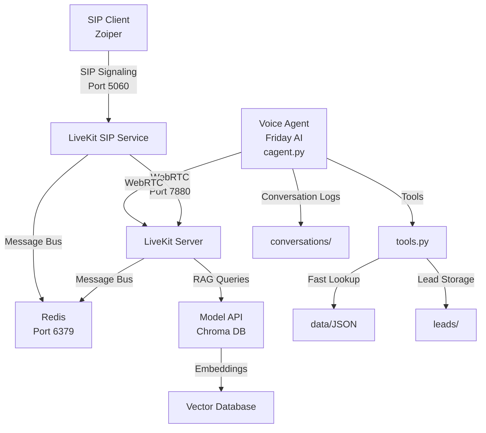

# Friday AI — Voice Agent with SIP Telephony and RAG

Friday AI is an intelligent voice assistant designed for Triotech Bizserve Pvt. Ltd., featuring complete SIP telephony integration, hybrid knowledge retrieval (static JSON + RAG), lead detection and capture, and seamless voice communication via LiveKit infrastructure.

## Features

- **SIP Telephony Integration**: Complete phone call support via LiveKit SIP bridge (Zoiper → LiveKit → AI Agent)
- **Hybrid Knowledge System**: Fast JSON lookups for basic queries + RAG-powered responses for complex technical questions
- **Voice Communication**: Real-time STT/TTS using LiveKit WebRTC with Redis message bus
- **Lead Management**: Automatic lead detection, validation, and storage in JSON format with Hinglish conversations
- **Conversation Logging**: Persistent conversation history with timestamps and lead tracking
- **Web API**: RESTful endpoints for RAG queries and web chat interface
- **Plugin Architecture**: Extensible with LiveKit plugins for LLM and TTS providers
- **Hinglish Support**: User-facing interactions in Hindi-English mix, internal data in English

## Architecture

### Complete System Overview



### Core Components
- **SIP Integration**: LiveKit SIP bridge handles phone call signaling and RTP-to-WebRTC conversion
- **Agent Core** (`cagent.py`): Main entry point with conversation logging and LiveKit session management
- **Tools** (`tools.py`): Business logic functions decorated with `@function_tool()`
- **Prompts** (`prompts.py`): System prompts and lead capture rules in Hinglish
- **Configuration** (`config.py`): Path helpers and shared utilities
- **RAG System** (`model/`): Vector database (ChromaDB), embeddings, and API server
- **Voice Integration**: LiveKit server for real-time comms, Redis for SIP PSRPC

### Data Flow
1. **SIP Call Flow**: Zoiper → SIP bridge → LiveKit server → Voice agent
2. **Voice Processing**: STT → Agent processing → Tools → TTS output
3. **Query Handling**: Basic queries → JSON lookup; Complex queries → RAG API  
4. **Lead Capture**: Intent detection → Validation → JSON storage in `leads/`
5. **Conversation Logs**: All interactions saved to `conversations/` with timestamped filenames

### Key Conventions
- **Language**: User-facing content in Hinglish; internal data (leads, logs) in English
- **Lead Fields**: `name`, `email`, `company`, `interest`, `phone`, `budget` (English only)
- **Log Naming**: `conversations/conversation_YYYYMMDD_HHMMSS.json`
- **RAG Settings**: Chunk size 1500, overlap 200
- **Tools Pattern**: All functions use `@function_tool()` decorator
- **SIP Room**: All calls route to `friday-assistant-room` in LiveKit

## Quick Start (PowerShell)

```powershell
# Install dependencies
pip install -r requirements.txt

# Build vector database (required for RAG)
python model/build_db.py

# SIP telephony setup (requires Redis running)
redis-cli ping  # verify Redis is running
livekit-server --config livekit.yaml  # start main server
cd sip-setup && ./livekit-sip --config config.yaml  # start SIP bridge

# Setup SIP routing (one-time)
lk project add friday --url ws://192.168.109.66:7880 --api-key APIntavBoHTqApw --api-secret pRkd16t4uYVUs9nSlNeMawSE1qmUzfV2ZkSrMT2aiFM
lk sip inbound create --project friday inbound_trunk.json
lk sip dispatch create --project friday sip_dispatch.json

# Run voice agent
python cagent.py

# Run RAG web API (optional)
python model/runapi.py

# Run tests
python test_triotech_assistant.py
python test_dummy_plugins.py
python test_lead_detection.py
```

## Installation

### Prerequisites
- Python 3.10+
- Redis server (for SIP bridge message bus)
- LiveKit server and SIP bridge binaries
- Docker (for containerized deployment)
- API keys for Google Gemini, HuggingFace, LiveKit, etc.

### Setup Steps

1. **Clone Repository**
   ```sh
   git clone <repository-url>
   cd friday-ai
   ```

2. **Install Dependencies**
   ```sh
   pip install -r requirements.txt
   ```

3. **Environment Configuration**
   - Copy `.env.example` to `.env`
   - Fill in required API keys:
     - `GOOGLE_API_KEY` (for Gemini LLM)
     - `HUGGINGFACE_API_KEY` (for embeddings)
     - `LIVEKIT_API_KEY` and `LIVEKIT_API_SECRET`
     - Other service keys as needed

4. **Redis Setup**
   ```sh
   # Install and start Redis
   redis-server
   redis-cli ping  # Should return PONG
   ```

5. **LiveKit Configuration**
   - Configure `livekit.yaml` with Redis connection
   - Configure `sip-setup/config.yaml` with identical API keys
   - Ensure ports 5060 (SIP), 7880 (LiveKit), 6379 (Redis) are available

6. **Build Knowledge Base**
   ```sh
   python model/build_db.py
   ```

7. **Verify Setup**
   ```sh
   python -c "import config; print(config.get_conversation_log_path())"
   ```

## Usage

### SIP Phone Calls
```sh
# Start the complete SIP telephony stack
redis-server                                 # Start Redis message bus
livekit-server --config livekit.yaml        # Start LiveKit server
cd sip-setup && ./livekit-sip --config config.yaml # Start SIP bridge
python cagent.py                             # Start voice agent

# Configure Zoiper or SIP client:
# Host: 192.168.109.66
# Username: 1001
# Password: 1001
# Dial any number to connect to Friday AI
```

### Voice Agent (LiveKit Direct)
```sh
python cagent.py
```
Starts the voice assistant with LiveKit integration for real-time conversations.

### RAG API Server
```sh
python model/runapi.py
```
Runs Flask API on port 5000 for RAG queries and web chat.

### Web Interface
Access `http://localhost:5000` for web-based chat interface (requires running `model/runapi.py`).

### SIP Testing and Debugging
```sh
# Monitor SIP traffic
sngrep

# Check room participants
lk room participants --room friday-assistant-room

# Verify service ports
ss -tulnp | grep -E "5060|7880|6379"
```

## Development

### Key Files to Read First
- `cagent.py` — Main agent entry point and LiveKit session management
- `tools.py` — Core business logic and function tools
- `prompts.py` — System prompts and lead capture rules in Hinglish
- `config.py` — Path helpers and shared utilities
- `model/build_db.py` & `model/runapi.py` — RAG system build and runtime
- `backup_plugin_modifications/` — Modified LiveKit plugin stubs
- `sip-setup/config.yaml` & `livekit.yaml` — SIP bridge and server configuration
- `docs/REPO_ARCHITECTURE.md` — Complete system architecture documentation
- `docs/Comprehensive Setup Guide_ Integrating a SIP Client with a Self-Hosted LiveKit Environment.md` — SIP setup guide

### End-to-End Files
- **Backend**: `cagent.py`, `generate_livekit_token.py`, `tools.py`, `model/runapi.py`
- **SIP Integration**: `sip-setup/config.yaml`, `sip-setup/inbound_trunk.json`, `sip-setup/sip_dispatch.json`
- **Frontend**: `friday-frontend/src/app/api/livekit/token/route.ts`, `friday-frontend/src/components/voice-assistant.tsx`
- **Plugins**: `backup_plugin_modifications/google_llm_modified.py`, `backup_plugin_modifications/cartesia_tts_modified.py`

### Adding New Features
1. Define business logic in `tools.py` with `@function_tool()` decorator
2. Update prompts in `prompts.py` if needed (maintain Hinglish for user-facing content)
3. Add unit tests following existing patterns
4. Rebuild RAG DB if knowledge files change: `python model/build_db.py`
5. Test SIP integration with phone calls for voice features

### SIP Configuration Changes
- **Trunk Setup**: Modify `sip-setup/inbound_trunk.json` for authentication credentials
- **Room Routing**: Update `sip-setup/sip_dispatch.json` for call routing rules
- **Agent Room**: Ensure `cagent.py` joins the same room as SIP dispatch (`friday-assistant-room`)
- **API Keys**: Keep `livekit.yaml` and `sip-setup/config.yaml` API keys synchronized

### Plugin Modifications
- Modified plugins stored in `backup_plugin_modifications/`
- Apply patches: `python docker_scripts/apply_modifications.py`
- Verify patches: `python docker_scripts/verify_modifications.py`

## Testing

Tests are simple Python scripts (not pytest):

```sh
# Core functionality tests
python test_triotech_assistant.py
python test_dummy_plugins.py
python test_lead_detection.py

# Inspect conversation logs
python -c "import config; print(config.get_conversation_log_path())"
```

### Test Coverage
- Agent tool functions
- Lead creation and validation
- Plugin integrations
- RAG API endpoints

## Deployment

### Multi-VM Production Deployment (Recommended)

For production scalability and reliability, deploy Friday AI across multiple VMs:

**Architecture:**
- **VM A (Agent Host)**: Python backend (`cagent.py`, `model/runapi.py`)
- **VM B (LiveKit Host)**: LiveKit server + Redis message bus  
- **VM C (SIP Host)**: LiveKit SIP bridge (internet-facing)

**Quick Setup:**
```bash
# VM A - Agent Host
git clone <repository-url> && cd friday-ai
python3.10 -m venv venv && source venv/bin/activate
pip install -r requirements.txt
python model/build_db.py

# VM B - LiveKit Host  
sudo apt install redis-server
curl -sSL https://get.livekit.io | bash
# Configure livekit.yaml with Redis connection

# VM C - SIP Host
git clone https://github.com/livekit/livekit-sip.git
go build -o livekit-sip ./cmd/livekit-sip
# Configure config.yaml pointing to VM B

# Setup LiveKit project and SIP routing
lk project add friday --url ws://VM_B_IP:7880 --api-key APIntavBoHTqApw --api-secret pRkd...
lk sip inbound create --project friday inbound_trunk.json  
lk sip dispatch create --project friday sip_dispatch.json
```

**See complete guide:** `docs/MULTI_VM_DEPLOYMENT.md`

### VM/Production Deployment

#### System Requirements
- **OS**: Ubuntu 20.04+ or CentOS 8+ (recommended for production)
- **RAM**: Minimum 4GB, recommended 8GB+
- **CPU**: 2+ cores for concurrent call handling
- **Storage**: 20GB+ for logs, leads, and vector database
- **Network**: Open ports 5060 (SIP), 7880 (LiveKit), 6379 (Redis), 10000-20000 (RTP)

#### Step 1: Server Preparation
```bash
# Update system
sudo apt update && sudo apt upgrade -y

# Install dependencies
sudo apt install -y python3.10 python3.10-pip python3.10-venv redis-server git wget curl build-essential

# Install Go (for LiveKit SIP bridge)
wget https://go.dev/dl/go1.21.0.linux-amd64.tar.gz
sudo tar -C /usr/local -xzf go1.21.0.linux-amd64.tar.gz
echo 'export PATH=$PATH:/usr/local/go/bin' >> ~/.bashrc
source ~/.bashrc

# Install LiveKit server
wget https://github.com/livekit/livekit/releases/latest/download/livekit-server_Linux_x86_64.tar.gz
tar -xzf livekit-server_Linux_x86_64.tar.gz
sudo mv livekit-server /usr/local/bin/

# Install LiveKit CLI
curl -sSL https://get.livekit.io/cli | sudo bash
```

#### Step 2: Application Setup
```bash
# Clone repository
git clone <repository-url>
cd friday-ai

# Create Python virtual environment
python3.10 -m venv venv
source venv/bin/activate

# Install Python dependencies
pip install -r requirements.txt

# Create application directories
sudo mkdir -p /opt/friday-ai/{logs,data,conversations,leads}
sudo chown -R $USER:$USER /opt/friday-ai

# Copy application files
cp -r . /opt/friday-ai/
cd /opt/friday-ai
```

#### Step 3: Configuration Setup
```bash
# Create environment file
cat > .env << 'EOF'
GOOGLE_API_KEY=your_google_api_key_here
HUGGINGFACE_API_KEY=your_huggingface_api_key_here
LIVEKIT_API_KEY=APIntavBoHTqApw
LIVEKIT_API_SECRET=pRkd16t4uYVUs9nSlNeMawSE1qmUzfV2ZkSrMT2aiFM
LLM_MODEL=gemini-2.5-flash
REDIS_URL=redis://localhost:6379
EOF

# Replace with your actual IP address
VM_IP="YOUR_VM_IP_ADDRESS"

# Create LiveKit server config
cat > livekit.yaml << EOF
port: 7880
bind_addresses:
  - 0.0.0.0
keys:
  APIntavBoHTqApw: pRkd16t4uYVUs9nSlNeMawSE1qmUzfV2ZkSrMT2aiFM
redis:
  address: '${VM_IP}:6379'
  db: 0
turn:
  enabled: true
  domain: ${VM_IP}
  tls_port: 5349
  udp_port: 3478
EOF

# Create SIP bridge config
mkdir -p sip
cat > sip-setup/config.yaml << EOF
api_key: APIntavBoHTqApw
api_secret: pRkd16t4uYVUs9nSlNeMawSE1qmUzfV2ZkSrMT2aiFM
ws_url: ws://${VM_IP}:7880
redis:
  address: ${VM_IP}:6379
sip_port: 5060
rtp_port: 10000-20000
use_external_ip: true
logging:
  level: info
EOF

# Create SIP trunk config
cat > sip-setup/inbound_trunk.json << 'EOF'
{
  "trunk": {
    "name": "Production Inbound Trunk",
    "auth_username": "1001",
    "auth_password": "1001"
  }
}
EOF

# Create SIP dispatch config (update after creating trunk)
cat > sip-setup/sip_dispatch.json << 'EOF'
{
  "dispatch_rule": {
    "name": "Production Dispatch Rule",
    "trunk_ids": ["REPLACE_WITH_TRUNK_ID"],
    "rule": {
      "dispatchRuleDirect": {
        "roomName": "friday-assistant-room"
      }
    }
  }
}
EOF
```

#### Step 4: Build LiveKit SIP Bridge
```bash
# Build SIP bridge from source
git clone https://github.com/livekit/livekit-sip.git /tmp/livekit-sip
cd /tmp/livekit-sip
go build -o livekit-sip ./cmd/livekit-sip
sudo mv livekit-sip /usr/local/bin/
cd /opt/friday-ai
```

#### Step 5: Service Configuration
```bash
# Create systemd service files
sudo tee /etc/systemd/system/redis-friday.service << 'EOF'
[Unit]
Description=Redis for Friday AI
After=network.target

[Service]
Type=notify
ExecStart=/usr/bin/redis-server /etc/redis/redis.conf
ExecReload=/bin/kill -USR2 $MAINPID
TimeoutStopSec=0
Restart=always
User=redis
Group=redis

[Install]
WantedBy=multi-user.target
EOF

sudo tee /etc/systemd/system/livekit-server.service << EOF
[Unit]
Description=LiveKit Server
After=network.target redis-friday.service
Requires=redis-friday.service

[Service]
Type=simple
User=$USER
WorkingDirectory=/opt/friday-ai
ExecStart=/usr/local/bin/livekit-server --config livekit.yaml
Restart=always
RestartSec=5
Environment=PATH=/usr/local/bin:/usr/bin:/bin

[Install]
WantedBy=multi-user.target
EOF

sudo tee /etc/systemd/system/livekit-sip.service << EOF
[Unit]
Description=LiveKit SIP Bridge
After=network.target livekit-server.service
Requires=livekit-server.service

[Service]
Type=simple
User=$USER
WorkingDirectory=/opt/friday-ai/sip
ExecStart=/usr/local/bin/livekit-sip --config config.yaml
Restart=always
RestartSec=5
Environment=PATH=/usr/local/bin:/usr/bin:/bin

[Install]
WantedBy=multi-user.target
EOF

sudo tee /etc/systemd/system/friday-agent.service << EOF
[Unit]
Description=Friday AI Voice Agent
After=network.target livekit-sip.service
Requires=livekit-sip.service

[Service]
Type=simple
User=$USER
WorkingDirectory=/opt/friday-ai
ExecStart=/opt/friday-ai/venv/bin/python cagent.py
Restart=always
RestartSec=10
Environment=PATH=/opt/friday-ai/venv/bin:/usr/local/bin:/usr/bin:/bin

[Install]
WantedBy=multi-user.target
EOF

sudo tee /etc/systemd/system/friday-rag.service << EOF
[Unit]
Description=Friday AI RAG API
After=network.target

[Service]
Type=simple
User=$USER
WorkingDirectory=/opt/friday-ai
ExecStart=/opt/friday-ai/venv/bin/python model/runapi.py
Restart=always
RestartSec=5
Environment=PATH=/opt/friday-ai/venv/bin:/usr/local/bin:/usr/bin:/bin

[Install]
WantedBy=multi-user.target
EOF
```

#### Step 6: Firewall Configuration
```bash
# Configure UFW firewall
sudo ufw enable
sudo ufw allow 22/tcp          # SSH
sudo ufw allow 5060/udp        # SIP signaling
sudo ufw allow 7880/tcp        # LiveKit WebSocket
sudo ufw allow 6379/tcp        # Redis (if external access needed)
sudo ufw allow 10000:20000/udp # RTP media ports
sudo ufw allow 5000/tcp        # RAG API (optional)

# Check firewall status
sudo ufw status verbose
```

#### Step 7: Build Knowledge Base and Start Services
```bash
# Build vector database
source venv/bin/activate
python model/build_db.py

# Reload systemd and start services
sudo systemctl daemon-reload
sudo systemctl enable redis-friday livekit-server livekit-sip friday-agent friday-rag
sudo systemctl start redis-friday
sudo systemctl start livekit-server
sudo systemctl start livekit-sip

# Wait for services to start, then setup SIP routing
sleep 10

# Setup LiveKit project and SIP routing
lk project add friday --url ws://${VM_IP}:7880 --api-key APIntavBoHTqApw --api-secret pRkd16t4uYVUs9nSlNeMawSE1qmUzfV2ZkSrMT2aiFM
TRUNK_ID=$(lk sip inbound create --project friday sip-setup/inbound_trunk.json | grep "SIPTrunkID:" | awk '{print $2}')
sed -i "s/REPLACE_WITH_TRUNK_ID/$TRUNK_ID/g" sip-setup/sip_dispatch.json
lk sip dispatch create --project friday sip-setup/sip_dispatch.json

# Start agent services
sudo systemctl start friday-agent
sudo systemctl start friday-rag
```

#### Step 8: Verification and Monitoring
```bash
# Check service status
sudo systemctl status redis-friday livekit-server livekit-sip friday-agent friday-rag

# Check logs
sudo journalctl -u livekit-server -f     # LiveKit server logs
sudo journalctl -u livekit-sip -f        # SIP bridge logs
sudo journalctl -u friday-agent -f       # Agent logs

# Test connectivity
redis-cli ping                           # Should return PONG
lk room participants --room friday-assistant-room  # Check agent in room

# Monitor system resources
htop                                     # Check CPU/memory usage
df -h                                    # Check disk usage
ss -tulnp | grep -E "5060|7880|6379"   # Check listening ports
```

#### Step 9: Production Optimizations
```bash
# Setup log rotation
sudo tee /etc/logrotate.d/friday-ai << 'EOF'
/opt/friday-ai/conversations/*.json /opt/friday-ai/leads/*.json {
    weekly
    rotate 12
    compress
    delaycompress
    missingok
    notifempty
    create 644 $USER $USER
}
EOF

# Setup automated backup script
sudo tee /opt/friday-ai/backup.sh << 'EOF'
#!/bin/bash
BACKUP_DIR="/opt/backups/friday-ai"
DATE=$(date +%Y%m%d_%H%M%S)

mkdir -p $BACKUP_DIR
tar -czf $BACKUP_DIR/friday-ai-$DATE.tar.gz \
    -C /opt/friday-ai \
    conversations/ leads/ model/chroma_db/ \
    --exclude='*.log'

# Keep only last 30 days of backups
find $BACKUP_DIR -name "friday-ai-*.tar.gz" -mtime +30 -delete
EOF

chmod +x /opt/friday-ai/backup.sh

# Add to crontab for daily backups
(crontab -l 2>/dev/null; echo "0 2 * * * /opt/friday-ai/backup.sh") | crontab -
```

### Docker Deployment (Alternative)
```bash
# Build and run with Docker Compose
docker-compose up -d

# Scale for production
docker-compose -f docker-compose.yml -f docker-compose.prod.yml up -d
```

## Security Notes

- **SIP Security**: API keys in `livekit.yaml` and `sip-setup/config.yaml` must be identical; protect from unauthorized access
- **Network Security**: Use firewalls to restrict SIP (5060) and RTP (10000-20000) ports to trusted networks
- **PII Protection**: Leads and conversation logs contain sensitive customer data
- **Token Management**: Use atomic writes or file locks for concurrent processes accessing leads/logs
- **API Secrets**: Keep `LIVEKIT_API_SECRET` secure; prefer backend token minting over frontend secret exposure
- **Input Validation**: Validate and sanitize all user inputs, especially lead data from voice conversations

## Contributing

1. Follow existing code patterns and conventions
2. Add unit tests for new functionality
3. Update documentation for API changes
4. Rebuild RAG DB after knowledge file modifications

## License

MIT License
