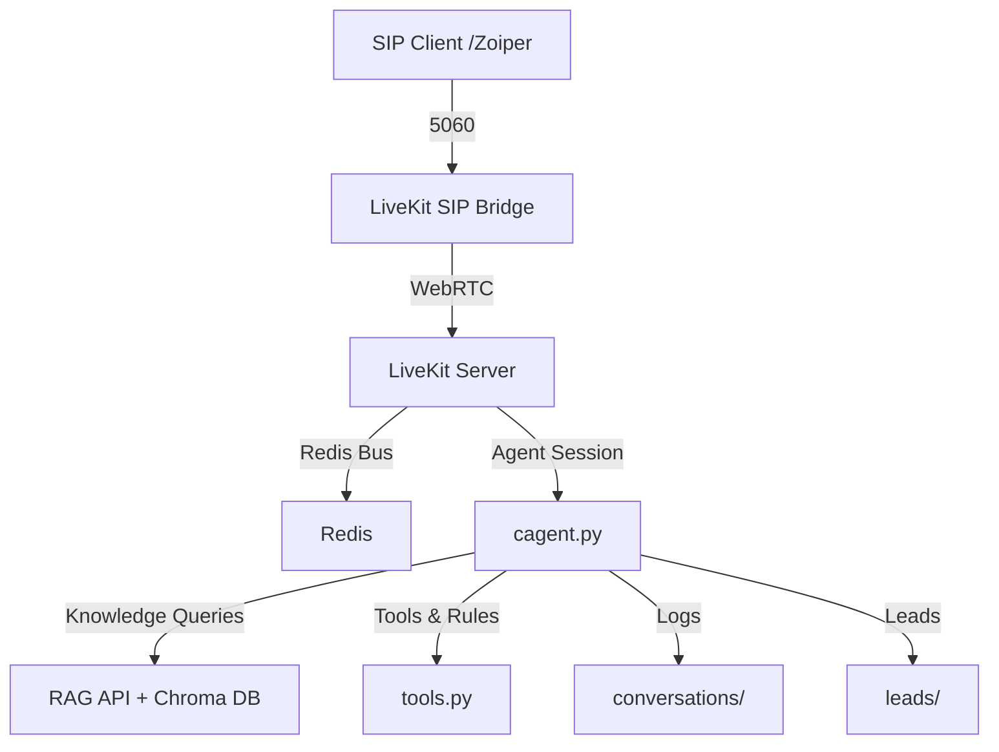

# Friday AI — Voice Agent with SIP Telephony + RAG

Friday AI is an intelligent voice assistant built for **Triotech Bizserve Pvt. Ltd.**  
It combines SIP telephony, RAG-based knowledge retrieval, and lead capture automation, all powered by LiveKit infrastructure.

## 🚀 Features

- SIP Telephony Integration (Zoiper ↔ LiveKit ↔ AI Agent)  
- Hybrid Knowledge System (JSON + RAG/ChromaDB)  
- Real-Time Voice Communication via WebRTC & Redis  
- Lead Management & Detection in Hinglish  
- Conversation Logging & Analytics  
- REST API for RAG Queries  
- Plugin-Ready Architecture for STT, TTS, and LLM providers

## 🧩 System Overview



---

## ⚙️ Deployment Guide

This guide details the complete manual steps to deploy the full stack.

### Step 1: System Prerequisites

Update your system and install all required packages, including Go and tools for building from source.

```bash
sudo apt update
sudo apt install -y curl wget git redis-server python3 python3-venv python3-pip screen build-essential pkg-config libopus-dev libopusfile-dev libsoxr-dev jq
```

# Install Go
```bash
wget https://go.dev/dl/go1.21.0.linux-amd64.tar.gz
sudo rm -rf /usr/local/go && sudo tar -C /usr/local -xzf go1.21.0.linux-amd64.tar.gz
echo 'export PATH=$PATH:/usr/local/go/bin' >> ~/.profile
source ~/.profile
go version
```

### Step 2: Setup Redis

Enable and start the Redis server. Verify that it's running correctly.

```bash
sudo systemctl enable redis-server
sudo systemctl start redis-server
redis-cli ping  # Expected output: PONG
```

### Step 3: Setup the Application

Clone the repository and set up the Python environment.

```bash
# Clone your repository
git clone <your-repo-url>
cd <your-repo-directory>

# Setup Python environment and activate it
python3 -m venv ainvenv
source ainvenv/bin/activate

# Install Python dependencies
pip3 install -r requirements.txt

# Optional: run plugin modification script if present
python setup_plugins.py || true
```

### Step 4: Install LiveKit Components

Download the server binary, build the SIP bridge from source, and install the CLI.

```bash
# Install LiveKit Server v1.9.1
wget https://github.com/livekit/livekit/releases/download/v1.9.1/livekit-server_1.9.1_linux_amd64.tar.gz
tar -xzf livekit-server_1.9.1_linux_amd64.tar.gz
sudo mv livekit-server /usr/local/bin/
sudo chmod +x /usr/local/bin/livekit-server

# Build LiveKit SIP Bridge from source
git clone https://github.com/livekit/sip.git
cd sip
go build -o livekit-sip ./cmd/livekit-sip
sudo mv livekit-sip /usr/local/bin/
cd ..

# Install LiveKit CLI using official installer
curl -sSL https://get.livekit.io/cli | bash
echo 'alias lk="livekit-cli"' >> ~/.bashrc
source ~/.bashrc
```

### Step 5: Start LiveKit Server

Start the core LiveKit server first. It must be running before configuring projects and trunks.

```bash
# Start LiveKit Server in a detached screen session
screen -dmS livekit-server livekit-server --config sip-setup/livekit.yaml
```

### Step 6: Configure SIP Routing & Verify

Follow these numbered steps to create a LiveKit project, provision an inbound SIP trunk, inject the produced trunk ID into your dispatch rule, and verify everything is correct.

```bash
# 1. Create a Project
# This command creates a new workspace called "friday" on your LiveKit server.
lk project add --name friday --url ws://127.0.0.1:7880 --api-key APIntavBoHTqApw --api-secret pRkd16t4uYVUs9nSlNeMawSE1qmUzfV2ZkSrMT2aiFM

# 2. Create a SIP Trunk and Automatically Get its ID
# This creates the secure entry point for your SIP client (like Zoiper) and uses the 'jq' tool
# to automatically save its unique ID into a variable.
TRUNK_ID=$(lk sip inbound create --project friday sip-setup/inbound_trunk.json | jq -r '.sip_trunk_id')
echo "Successfully created SIP Trunk with ID: $TRUNK_ID" # Example: ST_AbcDEfg123hIJ

# 3. Automatically Update the Routing Rule
# This command finds the placeholder 'REPLACE_WITH_TRUNK_ID' in your dispatch
# rule file and replaces it with the actual ID we just captured.
sed -i "s/REPLACE_WITH_TRUNK_ID/$TRUNK_ID/g" sip-setup/sip_dispatch.json

# 4. Create the Final Dispatch Rule
# Now that the rule is updated with the correct Trunk ID, this command uploads it to the server,
# creating the final link between your phone line and the AI agent's room.
lk sip dispatch create --project friday sip-setup/sip_dispatch.json

# 5. Verify Everything is Correct
# These commands let you see the project, trunk, and rule you just created on the server to confirm success.
echo "--- Verifying Configuration ---"
lk project list
lk sip inbound-trunk list
lk sip dispatch list
```

### Step 7: Start Remaining Services

Now that the server is running and configured, start the SIP bridge and the Python agent.

```bash
# Start LiveKit SIP Bridge
screen -dmS sip-bridge livekit-sip --config sip-setup/config.yaml

# Start the Python Backend Agent
screen -dmS backend bash -c "source ainvenv/bin/activate && python cagent.py dev"
```

### Step 8: Final Verification

```bash
# 1. Check active screen sessions
screen -ls

# 2. Check listening ports
sudo netstat -tunlp | grep -E '7880|5060|6379'

# 3. Verify Redis
redis-cli ping
```

---

## 📞 SIP Client Setup (Zoiper)

| Setting  | Value         |
| :------- | :------------ |
| Host     | `<YOUR-SERVER-IP>` |
| Port     | `5060`        |
| Username | `1001`        |
| Password | `1001`        |
| Protocol | `SIP (UDP)`   |

> Note: Once registered, dial any number to connect to the Friday AI agent.

## 🖥️ Service Management

### Check Running Services
```bash
screen -ls
redis-cli ping
```

### Attach to Service Logs
```bash
screen -r livekit-server
screen -r sip-bridge
screen -r backend
# Detach: Ctrl+A then D
```

### Stop Services
```bash
screen -S livekit-server -X quit
screen -S sip-bridge -X quit
screen -S backend -X quit
```

--- 

## 🔧 Configuration Files

- `.env` — API keys & environment variables  
- `sip-setup/livekit.yaml` — LiveKit server config  
- `sip-setup/config.yaml` — SIP bridge config  
- `sip-setup/inbound_trunk.json` — Inbound trunk definition  
- `sip-setup/sip_dispatch.json` — Dispatch rules

---

## 📝 Notes

- Add `REPLACE_WITH_TRUNK_ID` placeholder to `sip-setup/sip_dispatch.json` before running trunk creation step.  
- Protect PII in `leads/` and `conversations/`.  
- For production, prefer systemd units instead of `screen`.

**© 2025 Triotech Bizserve Pvt. Ltd. — All rights reserved.**