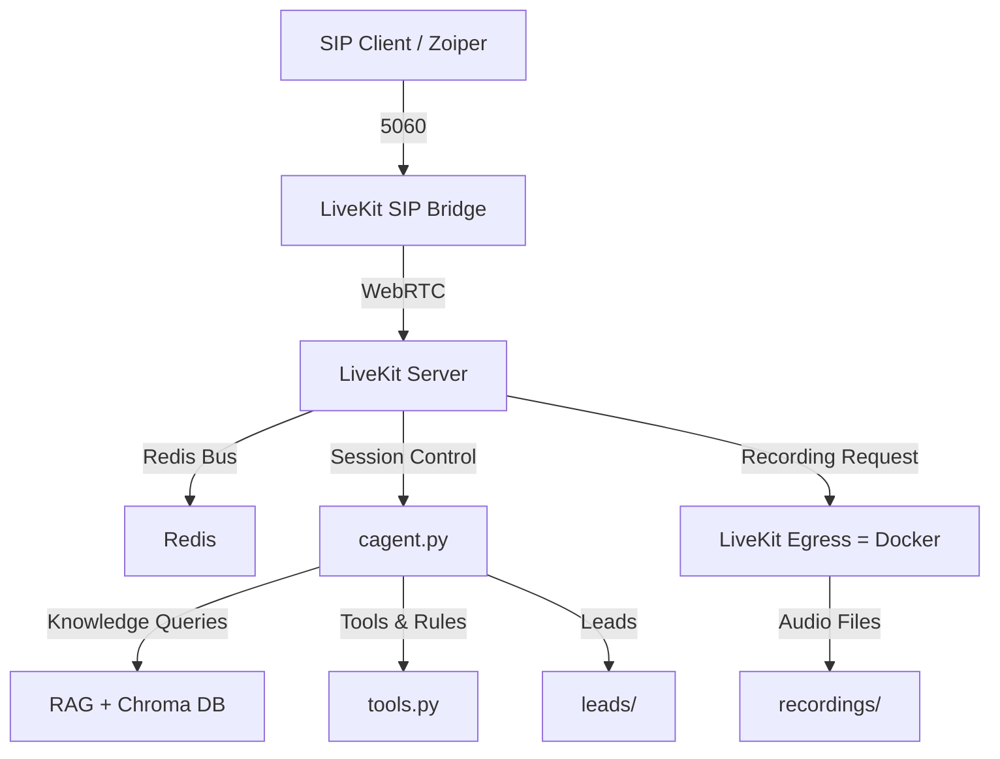

# Friday AI — Voice Agent with SIP Telephony + RAG

Friday AI is an intelligent voice assistant built for **Triotech Bizserve Pvt. Ltd.**
It combines SIP telephony, RAG-based knowledge retrieval, and lead capture automation — all powered by LiveKit infrastructure.

---

## 🚀 Features

* **SIP Telephony Integration** (Zoiper ↔ LiveKit ↔ AI Agent)
* **Hybrid Knowledge System** (JSON + RAG/ChromaDB)
* **Real-Time Voice Communication** via WebRTC & Redis
* **Lead Detection & Logging** in Hinglish
* **Local Audio Recording** via Docker Egress
* **Conversation Analytics + CRM Integration**
* **Plugin-Ready** for STT, TTS, and LLM Providers

---

## 🧩 System Overview



---

## ⚙️ Deployment Guide

This guide documents the **tested and stable deployment flow** verified on a VPS using Docker and screen.

---

### Step 1: System Prerequisites

```bash
sudo apt update
sudo apt install -y curl wget git redis-server python3 python3-venv python3-pip screen build-essential pkg-config libopus-dev libopusfile-dev libsoxr-dev jq docker.io
```

### Step 2: Setup Redis

```bash
sudo systemctl enable redis-server
sudo systemctl start redis-server
redis-cli ping  # Expected: PONG
```

---

### Step 3: Clone & Prepare Friday AI

```bash
# Clone the repository
git clone <your-repo-url>
cd <your-repo-directory>

# Create Python virtual environment
python3 -m venv ainvenv
source ainvenv/bin/activate

# Install dependencies
pip install -r requirements.txt
```

---

### Step 4: Install LiveKit Components

```bash
# Install LiveKit Server (v1.9.1)
wget https://github.com/livekit/livekit/releases/download/v1.9.1/livekit-server_1.9.1_linux_amd64.tar.gz
tar -xzf livekit-server_1.9.1_linux_amd64.tar.gz
sudo mv livekit-server /usr/local/bin/
sudo chmod +x /usr/local/bin/livekit-server

# Build SIP Bridge
git clone https://github.com/livekit/sip.git
cd sip
go build -o livekit-sip ./cmd/livekit-sip
sudo mv livekit-sip /usr/local/bin/
cd ..
```

---

### Step 5: Run LiveKit Server

```bash
# Start LiveKit Server in a detached session
screen -dmS livekit-server livekit-server --config sip-setup/livekit.yaml
```

---

### Step 6: Start LiveKit SIP Bridge

```bash
# Run SIP Bridge
screen -dmS livekit-sip livekit-sip --config sip-setup/config.yaml
```

Confirm both are active:

```bash
screen -ls
sudo netstat -tunlp | grep -E '7880|5060'
```

---

### Step 7: Start LiveKit Egress (Docker)

Friday AI uses Dockerized LiveKit Egress for **audio-only local recording**.

**egress.yaml**

```yaml
api_key: APIntavBoHTqApw
api_secret: pRkd16t4uYVUs9nSlNeMawSE1qmUzfV2ZkSrMT2aiFM
ws_url: ws://127.0.0.1:7880

redis:
  address: '127.0.0.1:6379'

# Default Storage (optional Azure config)
azure:
  account_name: xenystorage
  account_key: <REDACTED>
  container_name: livekit-recordings
```

**Run Egress:**

```bash
docker run -d \
  --name livekit-egress \
  --network="host" \
  -v $(pwd)/recordings:/recordings \
  -v $(pwd)/egress.yaml:/out/egress.yaml \
  livekit/egress
```

🟢 The system now records audio locally to:
`recordings/<room_name>-<timestamp>.ogg`

---

### Step 8: Start the Python Agent

```bash
screen -dmS livekit-backend bash -c "source ainvenv/bin/activate && python cagent.py"
```

---

### Step 9: Verification

```bash
# Check all running processes
screen -ls
sudo netstat -tunlp | grep -E '7880|5060|6379'
redis-cli ping
docker ps | grep livekit
```

🟢 Expected:

* LiveKit server on port `7880`
* SIP bridge on `5060`
* Redis on `6379`
* Egress container running and writing `.ogg` files

---

## 📞 SIP Client Setup (Zoiper)

| Setting  | Value              |
| -------- | ------------------ |
| Host     | `<YOUR_SERVER_IP>` |
| Port     | 5060               |
| Username | 1001               |
| Password | 1001               |
| Protocol | SIP (UDP)          |

> Dial any number (e.g., `+91XXXXXXXXXX`) to connect with the AI agent.
> Egress will automatically record the audio session locally.

---

## 🧠 Knowledge & Persona Handling

* The agent loads **persona settings dynamically** from the CRM endpoint via
  `load_persona_from_dialed_number()`.
* Knowledge retrieval uses **ChromaDB-based RAG** with a fallback JSON rule base.
* Logs and leads are stored locally under:

  * `conversations/`
  * `leads/`

---

## 🖥️ Service Management

```bash
# View running services
screen -ls

# Attach to a service
screen -r livekit-server
screen -r livekit-sip
screen -r livekit-backend

# Detach (Ctrl + A then D)
# Stop a service
screen -S livekit-sip -X quit
```

---

## 🧾 Configuration Summary

| File                     | Purpose                          |
| ------------------------ | -------------------------------- |
| `.env`                   | API keys & environment variables |
| `sip-setup/livekit.yaml` | Core LiveKit server config       |
| `sip-setup/config.yaml`  | SIP bridge config                |
| `egress.yaml`            | Egress recording configuration   |
| `cagent.py`              | Main AI voice agent              |
| `tools.py`               | Custom rules & helper functions  |

---

## 📝 Notes

* Audio files are **stored locally** in `recordings/`.
  Azure upload can be re-enabled later by uncommenting cloud paths in `egress.yaml`.
* Make sure Redis and LiveKit ports (`6379`, `7880`, `5060`) are open on your VPS.
* UFW should remain **disabled** or configured to allow UDP 10000–60000.
* For long-term stability, convert `screen` sessions to `systemd` services.

---

**© 2025 Triotech Bizserve Pvt. Ltd. — All rights reserved.**