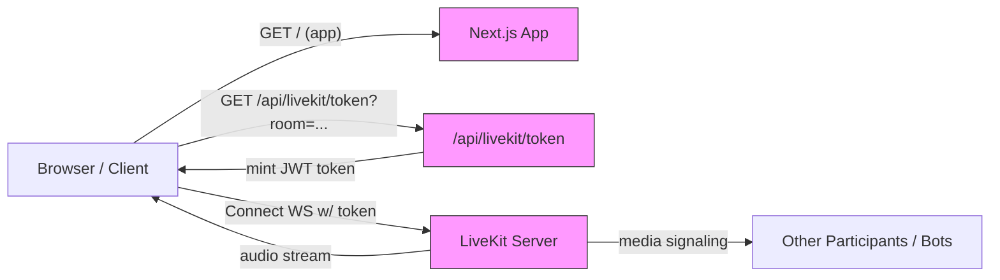
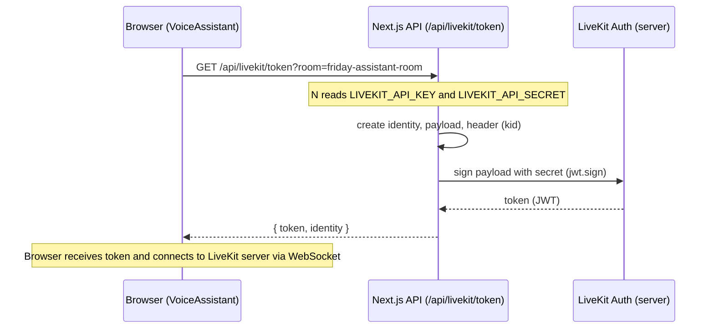
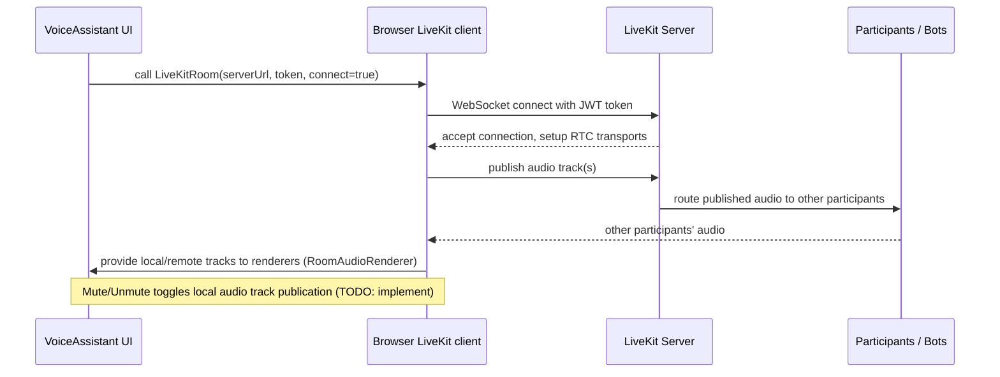
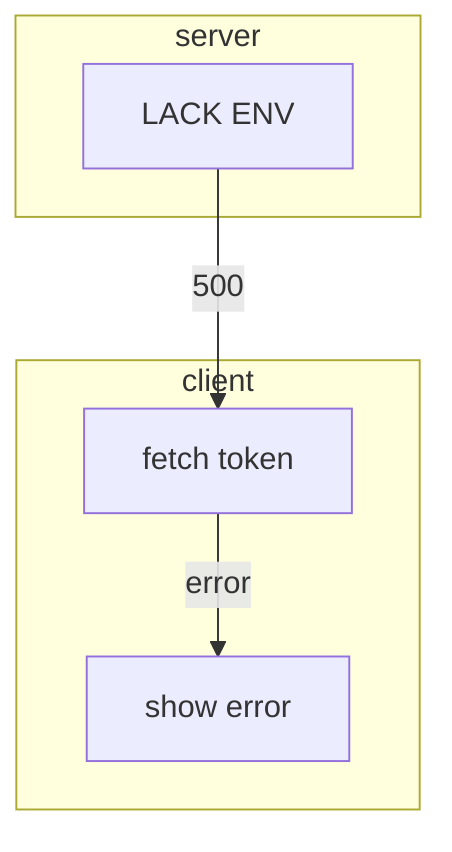
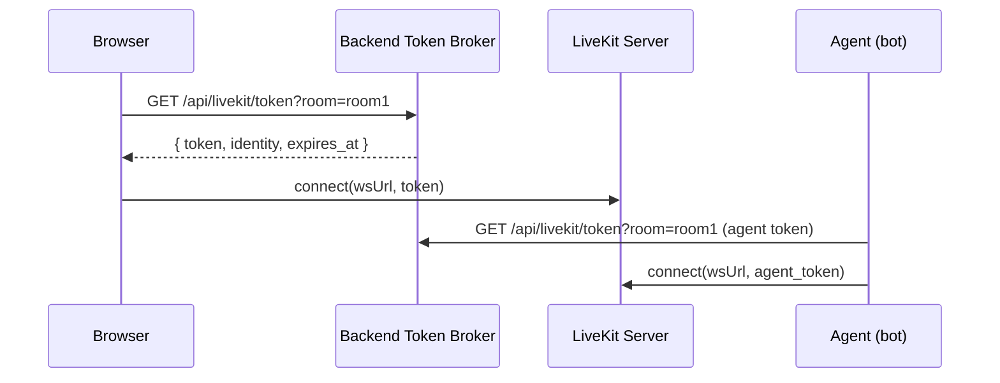

## Friday Frontend — Architecture Overview

This document explains the high-level and micro-level architecture of the `friday-frontend` repository.
It covers the why/what/where/when/how of the main processes, individual function notes (inputs, outputs, flow), directory structure, and sequence/flow diagrams using Mermaid. Use this as a single reference for developers onboarding or extending this repo.

---

## Goals & Motivation (Why)

- Provide a small web frontend for a voice assistant named "Friday" that connects to a LiveKit server for real-time audio/video sessions.
- Keep the app minimal and extensible: Next.js (App Router), React components, LiveKit client components, small server-side token minting endpoint.
- Securely mint and deliver short-lived LiveKit access tokens from the server (so secrets don't leak to the browser).
- Provide a consistent, accessible UI using a small design system (Card/Button components + Tailwind utilities).

Why each major choice:
- Next.js App Router: fast developer experience, server and client segments, file-based routing.
- LiveKit: real-time audio/video session platform. Using their token model for authentication and permissions.
- Server-side token mint endpoint: prevents exposing API secrets and gives control over grants/TTL.

---

## Repo / Directory Structure

Top-level (project root: `friday-frontend`)

```
friday-frontend/
  package.json               # project manifest, dependencies & scripts
  next.config.ts             # Next config (minimal)
  tsconfig.json              # TypeScript config
  README.md
  .env.local                 # local environment variables (not in repo)
  src/
    app/
      layout.tsx             # RootLayout — font loading + base HTML
      page.tsx               # Home page — renders VoiceAssistant
      api/
        livekit/token/route.ts# Server-side token mint endpoint (GET)
    components/
      voice-assistant.tsx    # Primary UI component that drives LiveKit interaction
      ui/
        button.tsx           # Reusable Button component
        card.tsx             # Reusable Card primitives
    lib/
      utils.ts               # small helpers (cn wrapper)
  public/                    # static assets (icons)
  components.json            # (project metadata / config)
  all_code_snippets.txt

```

Notes:
- Server-side code (token route) lives in the Next `app/api` route. The route mints JWTs using `jsonwebtoken`.
- Client-side components use `@livekit/components-react` to present and manage the session.

---

## High-Level System Diagram



This shows the two-step flow: token request from the browser to your server, then browser connects directly to LiveKit.

---

## Component & Process Breakdown (Group + Individual)

### 1) Next.js App (Server + Client)

- Files: `src/app/layout.tsx`, `src/app/page.tsx`
- Role: Serve the React app and provide server-side endpoints. `layout.tsx` configures font CSS variables and wraps pages. `page.tsx` renders the `VoiceAssistant` component.

Inputs/Outputs:
- Inputs: HTTP requests from browser for pages and API calls.
- Outputs: HTML/CSS/JS, JSON token responses for API.

When/Where:
- Runs within Node when Next dev or production server runs. API endpoints execute on the server runtime.

Edge cases:
- If fonts fail to load, fall back to defaults; Next handles font optimization.

### 2) Token Minting Endpoint

- File: `src/app/api/livekit/token/route.ts`
- Purpose: Build a JWT for LiveKit using `LIVEKIT_API_KEY` and `LIVEKIT_API_SECRET` server environment variables. Returns JSON { token, identity }.

Function: GET handler (async GET(req: Request))

Inputs:
- Query parameters: `room` (optional), `debug` (optional)
- Environment: `LIVEKIT_API_KEY`, `LIVEKIT_API_SECRET` required on server

Outputs:
- On success: JSON { token: string, identity: string } (or debug payload if debug=1)
- On failure: HTTP 500 with { error: string }

Flow (micro-level):
1. Read `room` from query string.
2. Validate presence of env vars `LIVEKIT_API_KEY` and `LIVEKIT_API_SECRET`.
3. Create an `identity` string: `web-<random>`.
4. Build a payload with `iat`, `nbf`, `exp` (1 hour TTL), `grants` including `roomJoin` and optional `room` scope.
5. Create header `{ alg: 'HS256', kid: apiKey }` and sign JWT using `jsonwebtoken`.
6. If `debug=1`, include decoded token payload for inspection. Otherwise return { token, identity }.

Important implementation details:
- Uses HS256 symmetric signing with `apiSecret`.
- `kid` header contains the `apiKey` for LiveKit to identify the key.
- TTL = 1 hour; this is configurable in code.

Security notes & edge cases:
- Never expose `LIVEKIT_API_SECRET` to the browser. Keep it in `.env` on server.
- Token TTL should be short enough for security but long enough for expected session lengths.
- Validate/whitelist `room` if necessary.

### 3) VoiceAssistant Component (Client)

- File: `src/components/voice-assistant.tsx`
- Purpose: Provide the UI to request a token, connect to LiveKit, display controls (mute/disconnect), and render LiveKit UI primitives.

Public functions / actions in file:
- fetchToken(room?: string) : Promise<string>
  - Input: optional room name
  - Output: token string
  - Flow: fetch(`/api/livekit/token${q}`) and return `data.token` or throw error

- handleConnect() : Promise<void>
  - Input: none (uses `roomName` state)
  - Output: sets token state and flip `isConnected` to true
  - Flow: call fetchToken, set token state for LiveKitRoom

- handleDisconnect()
  - Input: none
  - Output: reset connected state and clear token

- toggleMute()
  - Input: none
  - Output: toggle `isMuted` state (UI-only; integration with LiveKit publish track toggling is TODO)

Runtime interaction and lifecycle:
- Renders connection UI when not connected and a `LiveKitRoom` wrapper when connected + token present.
- `LiveKitRoom` comes from `@livekit/components-react`, passes `serverUrl`, `token`, and `connect={true}` to establish the session.
- Handles `onDisconnected` callback to clean up UI state.

Inputs/Outputs & Data shapes:
- Inputs: roomName string from input control, env NEXT_PUBLIC_LIVEKIT_URL for server URL
- Outputs: Visual UI, LiveKit connection via WebSocket to server URL with token

Edge cases and TODOs:
- If token fetch fails, component currently logs console error; better UX should show an inline error.
- `toggleMute` toggles UI state only; to actually mute/unmute media tracks, integrate with LiveKit hooks (e.g. via the `Room` instance or `useTracks` hooks) to disable audio publication.

### 4) UI primitives (Button / Card)

- Files: `src/components/ui/button.tsx`, `src/components/ui/card.tsx`
- Role: Small set of reusable UI components and variants. Keep markup consistent across the app.

Inputs/Outputs:
- Props: standard HTML props + design variants from `class-variance-authority`.
- Output: Styled DOM nodes.

Notes:
- `button.tsx` depends on `cn` from `src/lib/utils.ts` to merge class names.

### 5) Utility helpers

- `src/lib/utils.ts` exports `cn(...)` — a `clsx` + `tailwind-merge` wrapper.
- Input: class name arguments (ClassValue[]), Output: merged string.

---

## Sequence Diagrams (Mermaid)

### A — Token mint flow (browser -> Next -> LiveKit)



### B — Connect and media flow (browser <-> LiveKit server)



### C — Failure and debug flows



---

## API & Function Notes (Concise Reference)

1) GET /api/livekit/token
- Purpose: mint LiveKit JWT
- Inputs: query params: `room` (optional), `debug` (optional)
- Env vars required: `LIVEKIT_API_KEY`, `LIVEKIT_API_SECRET`
- Response: 200 { token, identity } or 500 { error }
- TTL: 3600s (1 hour) — configurable in code.

2) VoiceAssistant.fetchToken(room?)
- Input: room string (optional)
- Output: Promise<string> resolves to token
- Error modes: network error, non-OK status (throws an Error)

3) VoiceAssistant.handleConnect()
- Input: none (reads state.roomName)
- Output: updates React state: token and isConnected

4) LiveKitRoom component (3rd party library)
- Input: serverUrl, token, connect boolean, onDisconnected callback
- Output: mounts room context, renders controls, provides media tracks

---

## Deployment & Runtime Notes (Where & When)

- Local dev: run `npm run dev` (Next dev server). Ensure `.env.local` contains `LIVEKIT_API_KEY` and `LIVEKIT_API_SECRET` for the token endpoint. Optionally set `NEXT_PUBLIC_LIVEKIT_URL` to the URL of your LiveKit server.
- Production: host Next app (Vercel, self-hosted). Keep secrets in environment variables of host.
- LiveKit server should be reachable from clients (CORS / WS access). Provide correct `ws://` or `wss://` URL in `NEXT_PUBLIC_LIVEKIT_URL`.

Recommended .env entries (not committed):

```
LIVEKIT_API_KEY=your_livekit_api_key
LIVEKIT_API_SECRET=your_livekit_api_secret
NEXT_PUBLIC_LIVEKIT_URL=wss://your-livekit-server.example.com
```

---

## Edge Cases & Error Handling (Micro-level)

- Token endpoint missing env vars -> returns 500 and error message. Consider returning 401 for secret misconfiguration in future.
- Token fetch network failures -> UI logs error; should show UI snackbar/modal and retry option.
- Room name collisions -> LiveKit rooms are logical; if room exists other participants join. Consider using proper naming/ACL or room creation flow.
- Stale tokens -> if token expires mid-session, client needs re-auth flow; LiveKit supports reconnect with a fresh token. Implement auto-refresh or short rejoin flow.
- Mute/Unmute currently only toggles UI. Implement track.disable()/publish controls with LiveKit SDK to actually mute.

---

## Security Considerations

- Keep `LIVEKIT_API_SECRET` on server only.
- Use short-lived tokens. 1 hour is default here. For sensitive sessions, shorten TTL.
- Validate/whitelist allowed rooms or require user authentication before minting tokens.
- Log minimal sensitive information; do not log secrets or full tokens in production. Use the `debug=1` query only in local dev.

---

## Testing & Verification

Minimal manual smoke test:

1. Set environment variables in `.env.local` (or host env): LIVEKIT_API_KEY and LIVEKIT_API_SECRET plus NEXT_PUBLIC_LIVEKIT_URL.
2. Start dev server: `npm run dev`.
3. Open http://localhost:3000, enter a room name and click Connect.
4. Verify that browser gets a token (network tab -> /api/livekit/token) and that it connects to the LiveKit server.

Automated tests (suggested):
- Unit tests for token request wrapper (mock fetch) and error flows.
- Integration tests for token endpoint using a test LiveKit keypair.

---

## Next Steps and Improvements (Proactive extras)

- Surface token fetch and connection errors in the UI.
- Implement actual mute/unmute using LiveKit SDK calls (publish/unpublish or track enable/disable).
- Add automatic token refresh or re-auth flow when token is about to expire.
- Add additional server-side validation: rate-limiting, auth checks, room whitelist, analytics.
- Add e2e tests that simulate connecting to a test LiveKit instance.

---

## Quick Reference — Data Shapes

- Token response (200):
```json
{ "token": "<jwt>", "identity": "web-abc123" }
```

- Error response (500):
```json
{ "error": "message" }
```

---

## Appendix — Helpful Snippets

Fetch token (browser):

```ts
async function fetchToken(room?: string) {
  const q = room ? `?room=${encodeURIComponent(room)}` : ''
  const res = await fetch(`/api/livekit/token${q}`)
  if (!res.ok) throw new Error('Failed to fetch token')
  const data = await res.json()
  return data.token
}
```

Server-side token payload (example):

```json
{
  "jti": "random",
  "iss": "LIVEKIT_API_KEY",
  "sub": "web-xxxx",
  "iat": 169xxx,
  "nbf": 169xxx,
  "exp": 169xxx+3600,
  "grants": { "roomJoin": true, "video": { "roomJoin": true } }
}
```

---

Completion summary

- Created a single-file source of truth for architecture, flows, data shapes, and TODOs in `ARCHITECTURE.md`.
- Verified coverage of server token minting endpoint, client LiveKit connection, UI primitives, directory layout, and recommended next steps.

If you'd like, I can:
- Add a small automated test for the token endpoint (mocking env vars).
- Implement UI error handling for token fetch and show a retry control.
- Wire real mute/unmute using LiveKit SDK to toggle audio publication.
 

---

## Backend token-broker (recommended)

Add a small backend service that mints browser tokens and optionally agent tokens. Recommended implementation: `backend/livekit_token_api.py` (FastAPI). Endpoint contract (server-side only):

- GET /api/livekit/token?room=ROOM
  - Response 200: { "token": "<jwt>", "identity": "web-xxxx", "expires_at": 169xxx }
  - Optional headers: require `x-api-key` if TOKEN_API_KEY configured.
  - Rate-limiting: simple per-IP window (env: TOKEN_RATE_LIMIT_MAX, TOKEN_RATE_LIMIT_WINDOW).

Security notes:
- Keep `LIVEKIT_API_SECRET` only on backend. Do not place it in frontend `.env` in production.
- Use short TTLs (default 3600s) and preemptive client refresh.

Sample placement: `backend/livekit_token_api.py` (FastAPI) or integrate into your existing backend process.

## Frontend ↔ Backend integration (summary)

Canonical pattern (Pattern A, recommended): backend is the only token authority. Flow:

1. Browser requests token from backend `/api/livekit/token?room=...`.
2. Backend mints a short-lived JWT (signed with `LIVEKIT_API_SECRET`) and returns `{token, identity, expires_at}`.
3. Browser connects to LiveKit with token. Backend/agent uses its own server token to join as bot.

Alternate (dev) pattern (Pattern B): Next.js token route mints tokens using secrets in `friday-frontend` server. This is acceptable for development but increases secret surface area. If you cutover to Pattern A, remove secrets from frontend env and update `friday-frontend/src/app/api/livekit/token/route.ts` to proxy or call backend token broker.

Files to update when changing token authority:
- Frontend: `friday-frontend/src/app/api/livekit/token/route.ts`, `friday-frontend/src/components/voice-assistant.tsx`
- Backend: `backend/livekit_token_api.py` (or `generate_livekit_token.py` / `cagent.py` helper)

## Token lifecycle & client behavior

- TTL/refresh: client should preemptively refresh when remaining lifetime < 120s. Backend may include `expires_at` in response to simplify client logic.
- Retry/backoff: on 429 use exponential backoff (1s, 2s, 4s) max 3 attempts; on network errors try 1 immediate retry.
- Rejoin flow: if LiveKit emits auth error mid-session, obtain a fresh token and re-establish the connection.

Snippet (client logic):

1. fetch token -> connect to LiveKit
2. set timer to refresh at (exp - now - 120s)
3. on token error: attempt refresh + rejoin

## Frontend validation checklist (what backend expects)

These are the client-side validation rules the backend assumes; server must still re-validate.

- name: required, trim, 2–200 chars
- email: required, basic RFC-like validation, max 254 chars
- company: required, 1–200 chars
- interest: required, 1–1000 chars
- phone: optional, normalize digits, prefer E.164 when possible (+[country][number]), 9–15 digits
- budget: optional, max 100 chars
- Payload size limit: reject requests > 16KB
- Error response format (400): { "errors": { "field": "reason" } }

## Dev & test commands (PowerShell)

Start backend FastAPI token broker (example):

```powershell
# in repo root
python -m pip install fastapi uvicorn PyJWT
python backend\livekit_token_api.py

# request a token
Invoke-RestMethod -Uri "http://localhost:8000/api/livekit/token?room=testroom"
```

Decode token payload quickly (Python):

```powershell
python - <<'PY'
import jwt
token = "<paste token here>"
print(jwt.decode(token, options={"verify_signature": False}))
PY
```

Frontend quick-check:

```powershell
cd friday-frontend
npm install
npm run dev
# open http://localhost:3000 and test Connect
```

## Diagram: canonical token flow (Mermaid)



---

If you want I can:
- add the FastAPI file `backend/livekit_token_api.py` and a unit test that validates payload claims, or
- add a small `README.md` for token-broker deployment and env var examples.

