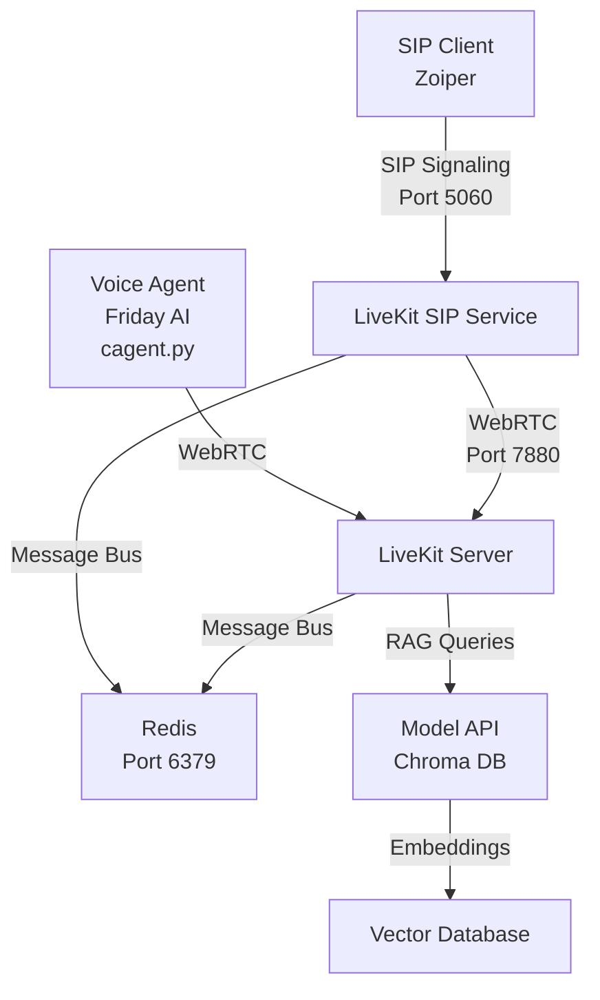
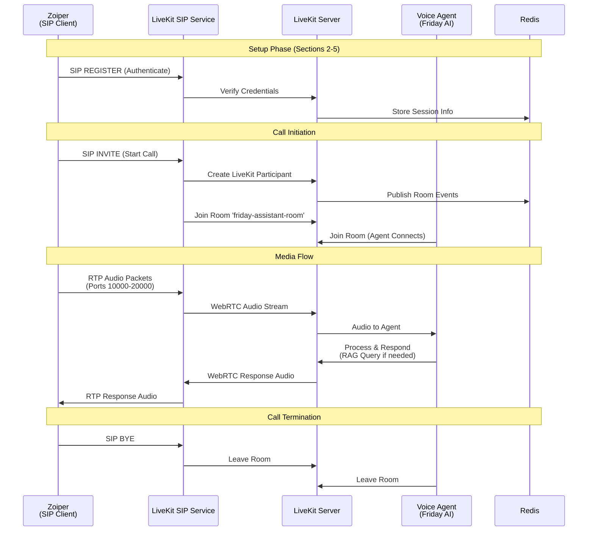

# **Comprehensive Setup Guide: Integrating a SIP Client with a Self-Hosted LiveKit Environment**

## **1️⃣ Introduction & Architecture**

This document provides a detailed, step-by-step guide for setting up a self-hosted LiveKit environment to accept calls from a SIP client (like Zoiper). This setup bridges traditional telephony with modern WebRTC, enabling real-time voice applications.

The architecture consists of several key components that must be configured correctly to communicate with each other:

- **LiveKit Server:** The core WebRTC service that manages rooms, participants, and media tracks. It acts as the central hub for all real-time communication.
- **LiveKit SIP Service:** A separate application that acts as a bridge. It receives calls via the SIP protocol and translates them into a format the LiveKit Server can understand.
- **Redis:** An in-memory data store that serves as the critical message bus between the LiveKit Server and the SIP Service. If they cannot both connect to Redis, the system will fail.
- **lk CLI:** The command-line interface used to manage LiveKit resources like SIP Trunks and Dispatch Rules.
- **Zoiper:** The SIP softphone client used to place test calls into the system.

### Architecture Diagram



---

## **1.5️⃣ Prerequisites and Installation Methods**

Before configuring the services, you need to install the required binaries. Choose the method that best fits your deployment scenario:

### **Option 1: Download Precompiled Binaries (Recommended for Production)**

**LiveKit Server:**
```bash
# Download specific version for reproducible deployments
wget https://github.com/livekit/livekit/releases/download/v1.9.1/livekit-server_1.9.1_linux_amd64.tar.gz
tar -xzf livekit-server_1.9.1_linux_amd64.tar.gz
sudo mv livekit-server /usr/local/bin/
```

**LiveKit SIP Bridge:**
```bash
# Download precompiled SIP bridge
wget https://github.com/livekit/livekit-sip/releases/download/v1.9.1/livekit-sip_1.9.1_linux_amd64.tar.gz
tar -xzf livekit-sip_1.9.1_linux_amd64.tar.gz
sudo mv livekit-sip /usr/local/bin/
sudo chmod +x /usr/local/bin/livekit-sip
```

### **Option 2: Build from Source (For Development/Customization)**

**Install Go (if not already installed):**
```bash
# Method 1: Using wget
wget -q https://go.dev/dl/go1.24.3.linux-amd64.tar.gz
sudo rm -rf /usr/local/go && sudo tar -C /usr/local -xzf go1.24.3.linux-amd64.tar.gz

# Method 2: Using curl (alternative)
curl -sSfL https://go.dev/dl/go1.24.3.linux-amd64.tar.gz -o go1.24.3.linux-amd64.tar.gz
sudo rm -rf /usr/local/go && sudo tar -C /usr/local -xzf go1.24.3.linux-amd64.tar.gz

# Add Go to PATH
export PATH=$PATH:/usr/local/go/bin
echo 'export PATH=$PATH:/usr/local/go/bin' >> ~/.bashrc
```

**Build LiveKit SIP Bridge:**
```bash
git clone https://github.com/livekit/livekit-sip.git
cd livekit-sip
go build -o livekit-sip ./cmd/livekit-sip
sudo mv livekit-sip /usr/local/bin/
sudo chmod +x /usr/local/bin/livekit-sip
```

### **Option 3: Package Manager (Latest Stable)**
```bash
# Install LiveKit server and CLI via package manager
curl -sSL https://get.livekit.io | bash
curl -sSL https://get.livekit.io/cli | sudo bash

# Create convenient alias for CLI
echo 'alias lk="livekit-cli"' >> ~/.bashrc
source ~/.bashrc
```

### **Automated Setup Script Approach**

For fully automated deployments, you can use version variables:

```bash
# Set versions for reproducible deployments
LIVEKIT_VERSION="1.9.1" 
SIP_VERSION="1.5.1"
CLI_VERSION="1.5.2"

# Update system and install dependencies
sudo apt update && sudo apt install -y curl wget unzip tar screen git redis-server

# Enable and verify Redis
sudo systemctl enable redis-server
sudo systemctl start redis-server
redis-cli ping || { echo "❌ Redis not responding"; exit 1; }

# Install binaries with version control
cd /tmp
wget -q https://github.com/livekit/livekit/releases/download/v${LIVEKIT_VERSION}/livekit-server_${LIVEKIT_VERSION}_linux_amd64.tar.gz
tar -xzf livekit-server_${LIVEKIT_VERSION}_linux_amd64.tar.gz
sudo mv livekit-server /usr/local/bin/
sudo chmod +x /usr/local/bin/livekit-server

wget -q https://github.com/livekit/livekit-sip/releases/download/v${SIP_VERSION}/livekit-sip_${SIP_VERSION}_linux_amd64.tar.gz
tar -xzf livekit-sip_${SIP_VERSION}_linux_amd64.tar.gz
sudo mv livekit-sip /usr/local/bin/
sudo chmod +x /usr/local/bin/livekit-sip

wget -q https://github.com/livekit/livekit-cli/releases/download/v${CLI_VERSION}/livekit-cli_${CLI_VERSION}_linux_amd64.tar.gz
tar -xzf livekit-cli_${CLI_VERSION}_linux_amd64.tar.gz
sudo mv livekit-cli /usr/local/bin/
sudo chmod +x /usr/local/bin/livekit-cli

# Verify installations
echo "✅ Versions:"
livekit-server --version
livekit-sip --version
livekit-cli --version
```

---

## **2️⃣ Core Server Configuration**

The first step is to ensure both the main server and the SIP service are configured correctly. A mismatch in this foundational step was the source of several issues.

### **Step 2.1: Configure the LiveKit Server (livekit.yaml)**

The main livekit-server must be explicitly configured to connect to Redis. Without this, it cannot communicate with the SIP service, leading to "sip not connected" errors.

1. **Create the configuration file:** In your project root (`/mnt/c/Users/int10281/Desktop/Github/Friday - Copy/`), create a file named `livekit.yaml`.
2. **Add the following content:** This configuration defines the server's port, API keys, and the crucial Redis connection.

  ```yaml
  # livekit.yaml

  port: 7880
  bind_addresses:
    - 0.0.0.0
  keys:
    APIntavBoHTqApw: pRkd16t4uYVUs9nSlNeMawSE1qmUzfV2ZkSrMT2aiFM

  # This section is required for SIP functionality
  redis:
    address: '192.168.109.66:6379'
    db: 0
  ```

### **Step 2.2: Configure the SIP Service (config.yaml)**

The livekit-sip service needs its own configuration to connect to both Redis and the main server's API. The API keys here **must be identical** to those in `livekit.yaml`.

1. **Navigate to your SIP directory:**

  ```bash
  cd '/mnt/c/Users/int10281/Desktop/Github/Friday - Copy/sip'
  ```

2. **Create/Edit the configuration file:** Ensure the file `config.yaml` has the following content. This version is cleaned of any hidden formatting errors and uses the modern Trunk-based approach (the legacy users block has been removed).

  ```yaml
  # config.yaml (Final, Cleaned Version)

  api_key: APIntavBoHTqApw
  api_secret: pRkd16t4uYVUs9nSlNeMawSE1qmUzfV2ZkSrMT2aiFM
  ws_url: ws://192.168.109.66:7880
  redis:
    address: 192.168.109.66:6379
  sip_port: 5060
  rtp_port: 10000-20000
  use_external_ip: false
  logging:
    level: debug
  ```

---

## **3️⃣ Running and Verifying the Services**

The services must be started in the correct order.

1. **Start Redis:** Ensure your Redis server is running.
  - **Verification Command:**

    ```bash
    sudo systemctl enable redis-server
    sudo systemctl start redis-server
    redis-cli ping  # Should return PONG
    ```

2. **Start the LiveKit Server:**
  - **Start Command (detached session using screen):**

    ```bash
    # Start LiveKit Server (recommended: versioned binary)
    screen -dmS livekit-server livekit-server --config sip-setup/livekit.yaml
    ```

  - **Verification:** Check the logs or attach to the screen session: `screen -r livekit-server` and watch for "connecting to redis" and "starting LiveKit server".

3. **Start the SIP Service (after LiveKit is running):**
  - **Start Command (detached session using screen):**

    ```bash
    screen -dmS sip-bridge livekit-sip --config sip-setup/config.yaml
    ```

  - **Verification:** Attach to the session or inspect logs: `screen -r sip-bridge` and look for "connecting to redis" and "sip signaling listening on".

### **Alternative: Screen Session Management**

For development or environments without systemd, you can use screen sessions:

```bash
# Install screen if not available
sudo apt install -y screen

# Start services in detached screen sessions
screen -dmS livekit-server bash -c "livekit-server --config livekit.yaml"
screen -dmS sip-bridge bash -c "cd sip-setup && ./livekit-sip --config config.yaml"
screen -dmS friday-agent bash -c "python cagent.py"

# List running screen sessions
screen -ls

# Attach to a session (use Ctrl+A, then D to detach)
screen -r livekit-server

# Wait for services to start and verify ports
sleep 5
echo "🔍 Checking running ports:"
sudo netstat -tunlp | grep -E '7880|5060|6379'
```

---

## **4️⃣ Creating the SIP Trunk and Dispatch Rule**

Now, we'll configure how the system handles incoming calls using the lk CLI.

### **Step 4.1: Configure the lk CLI Project**

The CLI needs to know which project to work with.

1. **Add the project:**

  ```bash
  lk project add friday --url ws://192.168.109.66:7880 --api-key APIntavBoHTqApw --api-secret pRkd16t4uYVUs9nSlNeMawSE1qmUzfV2ZkSrMT2aiFM
  ```

2. **Set the default project:**

  ```bash
  lk project set-default friday
  ```

3. **Verification Command:**

  ```bash
  lk project list
  ```

  - **Expected Output:** A table showing the `friday` project as the default (marked with an asterisk).

### **Step 4.2: Create the Inbound SIP Trunk**

### LiveKit-sip project and trunk creation


This trunk defines the credentials Zoiper will use to authenticate.

**Method 1: Manual JSON creation**

1. **Create the file `inbound_trunk.json`:**
  - **Path:** `/mnt/c/Users/int10281/Desktop/Github/Friday - Copy/sip-setup/`
  - **Content:**

    ```json
    {
     "trunk": {
      "name": "Zoiper Local Inbound",
      "auth_username": "1001",
      "auth_password": "1001"
     }
    }
    ```

**Method 2: Automated JSON creation (Recommended)**

```bash
# Create inbound trunk configuration programmatically
cat <<EOF > inbound_trunk.json
{
  "name": "Zoiper Local Inbound",
  "authUsername": "1001",
  "authPassword": "1001", 
  "mediaEncryption": "SIP_MEDIA_ENCRYPT_DISABLE"
}
EOF
```

2. **Run the creation command:**

  ```bash
  TRUNK_ID=$(lk sip inbound create --project friday inbound_trunk.json | grep "SIPTrunkID:" | awk '{print $2}')
  echo "Created trunk with ID: $TRUNK_ID"
  ```

3. **Verification Command:**

  ```bash
  lk sip inbound-trunk list
  ```

  - **Expected Output:** A table listing your newly created "Zoiper Local Inbound" trunk.

### **Step 4.3: Create the SIP Dispatch Rule**

This rule routes authenticated calls from the trunk to a specific LiveKit room.

**Method 1: Manual creation with saved Trunk ID**

1. **Create the file `sip_dispatch.json`:**
  - **Path:** `/mnt/c/Users/int10281/Desktop/Github/Friday - Copy/sip-setup/`
  - **Content:** Replace `ST_EmMmjttJHZHP` with the Trunk ID you saved.

    ```json
    {
     "dispatch_rule": {
      "name": "Zoiper to Assistant Room Rule",
      "trunk_ids": ["ST_EmMmjttJHZHP"],
      "rule": {
        "dispatchRuleDirect": {
         "roomName": "friday-assistant-room"
        }
      }
     }
    }
    ```

**Method 2: Automated creation using captured Trunk ID (Recommended)**

```bash
# Create dispatch rule with the captured trunk ID
cat <<EOF > sip_dispatch.json
{
  "name": "Zoiper Individual Dispatch Rule",
  "trunk_ids": ["$TRUNK_ID"],
  "rule": {
    "dispatchRuleIndividual": {
      "roomPrefix": "call-"
    }
  }
}
EOF
```

2. **Run the creation command:**

  ```bash
  lk sip dispatch create --project friday sip_dispatch.json
  ```

  - **Expected Output:** `SIPDispatchRuleID: SDR_z8poRnoYDZPB` (Your ID will be different).

3. **Verification Commands:**

  ```bash
  # Verify all configurations
  lk sip inbound-trunk list
  lk sip dispatch list
  
  # Check network ports
  sudo netstat -tunlp | grep -E '7880|5060|6379'
  
  # Verify service versions
  echo "✅ Service versions:"
  livekit-server --version
  livekit-sip --version
  livekit-cli --version
  ```

---

## **5️⃣ SIP Client (Zoiper) Configuration**

Configure your Zoiper client to register with your livekit-sip service.

1. Go to **Settings → Accounts → Add Account** and choose **Manual Configuration** for a **SIP** account.
2. Enter the following details:
  - **Host / Domain:** 192.168.109.66
  - **Username:** 1001
  - **Password:** 1001
3. Save the account.
4. **Verification:** Look for a green checkmark or a "Registered" status next to the account in Zoiper. You should also see Inbound SIP REGISTER messages in your livekit-sip service logs.

---

## **6️⃣ End-to-End Test**

With all services running and Zoiper registered, dial any number from the Zoiper client. The call should connect, and you will be placed into the `friday-assistant-room`.

- **Verification:**
  - The livekit-sip logs will show "SIP invite authentication successful" followed by "Joining room".
  - The livekit-server logs will show events for a new participant joining the `friday-assistant-room`.

Once the call is connected, ensure the voice agent is running to handle the conversation. Run `python cagent.py` in the project root to start the Friday AI voice assistant.

### Call Flow Diagram



---

## **7️⃣ Troubleshooting Common Issues**

- **Error: twirp error... sip not connected (redis required)**
  - **Cause:** The main livekit-server is not connected to Redis.
  - **Solution:** Ensure your `livekit.yaml` has the correct `redis` block and that you are starting the server with `livekit-server --config livekit.yaml`.

- **Error: Cannot create LiveKit participant... "error": "missing API key or secret key"**
  - **Cause:** The API key/secret in `config.yaml` does not match `livekit.yaml`, often due to a typo or a hidden formatting error.
  - **Solution:** Stop both services. Carefully copy the keys from `livekit.yaml` and paste them into the `livekit` block in `config.yaml`. Use the cleaned `config.yaml` from this guide to avoid formatting issues.

- **Zoiper Fails to Register**
  - **Cause:** Firewall blocking port 5060, incorrect IP in Zoiper's "Host" field, or the livekit-sip service is not running.
  - **Solution:** Verify the host IP is `192.168.109.66`. Check that the livekit-sip process is active and listening. Ensure no firewalls are blocking UDP/TCP traffic on port 5060.

- **Call session established but voice not transmitted from caller to bot or bot not listening**
  - **Cause:** The voice agent (Friday AI) is not running or not connected to the LiveKit room.
  - **Solution:** 
    1. Start the voice agent: In the project root (`/mnt/c/Users/int10281/Desktop/Github/Friday - Copy/`), run `python cagent.py`.
    2. Verify the agent is in the room: Check LiveKit server logs or use CLI:
       ```bash
       lk room participants --room friday-assistant-room
       ```
       You should see the SIP participant and the agent participant.
    3. Check agent logs for any connection errors.
  - **Cause:** RTP media ports blocked by firewall.
  - **Solution:** Ensure UDP ports 10000-20000 are open and the livekit-sip service can bind to them. Use tools like `sngrep` to monitor SIP traffic and check for RTP packets.

## **8️⃣ Example call and generated lead (validation)**

Below is an example call transcript taken from a real test session and the lead JSON that the assistant created. Use this as a validation reference to confirm the end-to-end flow (SIP -> livekit-sip -> LiveKit -> voice agent -> lead storage).

### Example conversation excerpt

```
Agent: Namaste! Main Triotech ki Sales Assistant hoon. Main aapki kis tarah help kar sakti hoon?

User: Hello?

Agent: Ji, hello! Main Triotech ki Sales Assistant hoon. Main aapki kis tarah help kar sakti hoon? Kya aapko hamare AI-powered products ke baare mein jaankari chahiye, ya aapke business ke liye koi specific solution dhoondh rahe hain?

User: आप मेरे को try tech के products के बारे में बता सकते हैं try

Agent: Maaf kijiye, abhi is query ke liye exact products ki list available nahi hai. Lekin, main aapko hamare kuch popular solutions ke baare mein bata sakti hoon...

User: रिंगिंगों के बारे में जानना है.

Agent: Ringingo ek AI Dialer hai jo automated call handling, smart routing, aur real-time metrics ke saath aata hai.

User: नहीं मेरे को sales team के साथ connect कर दीजिए please.

Agent: Ji, bilkul! Sales team se connect karne ke liye, kya main aapka naam, email, company ka naam, aur phone number jaan sakti hoon? Aur aapka budget kya hai Ringingo ke लिए?

User: मेरा नाम मलय जैन है. मेरा company का नाम

Agent: Shukriya, Malay Jain ji! Aapki details note kar li hain: Name: Malay Jain, Company: 3inovi, Phone Number: 7232155888, Budget: 4-5 Lakhs

User (spoken): My phone number is six two three two one, double five, triple eight.

Agent: Shukriya, Malay Jain ji! Aapki complete details ab mere paas hain: Name: Malay Jain, Email: malayjain1234@gmail.com, Company: 3inovi, Phone Number: 6232155888, Interested Product: Ringingo, Budget: 4-5 Lakhs

Agent: Shukriya! Aapki details hamari sales team ke saath share kar di gayi hain. Hamari sales team aapse jaldi contact karegi Ringingo ke baare mein discuss karne ke लिए.
```

### Generated lead (leads/lead_20251007_164608.json)

```json
{
  "timestamp": "2025-10-07T16:46:08.546889",
  "source": "Friday AI Assistant",
  "status": "new",
  "name": "Malay Jain",
  "email": "malayjain1234@gmail.com",
  "company": "3inovi",
  "interest": "Ringingo",
  "phone": "6232155888",
  "job_title": "",
  "budget": "4-5 Lakhs",
  "timeline": ""
}
```

### sngrep capture


<!-- Place this JSON file in the `leads/` folder exactly as shown. The agent's `create_lead()` tool (see `tools.py`) should produce a similarly-named file automatically when lead detection triggers.

### Where to add validation screenshots / images

Add the following screenshots to the repository (suggested filenames and where to place them). These images are referenced in this guide as visual validation points.

- `conversations/sip_sngrep_example.png` — sngrep capture showing SIP INVITE/200 OK and RTP negotiation. Place under `conversations/`.
- `logs/livekit_sip_start.png` — livekit-sip startup log showing "connecting to redis" and "sip signaling listening on". Place under `logs/`.
- `logs/livekit_server_redis.png` — livekit-server log showing Redis connection. Place under `logs/`.
- `leads/lead_20251007_164608.png` — screenshot of the lead JSON or the lead file listing. Place under `leads/`.
- `screenshots/agent_in_room.png` — LiveKit/web UI or CLI output showing both SIP participant and agent in `friday-assistant-room` (e.g., `lk room participants --room friday-assistant-room`). Place under `screenshots/`.


These visual references make it easy to confirm correct behavior during tests and troubleshooting. -->

#### **Works cited**

1. How to set SIP/IAX2 account with Zoiper - Frequently Asked Questions :: Zoiper, accessed October 6, 2025, [https://www.zoiper.com/en/support/home/article/192/How%20to%20set%20SIP%2FIAX2%20account%20with%20Zoiper](https://www.zoiper.com/en/support/home/article/192/How%20to%20set%20SIP%2FIAX2%20account%20with%20Zoiper)