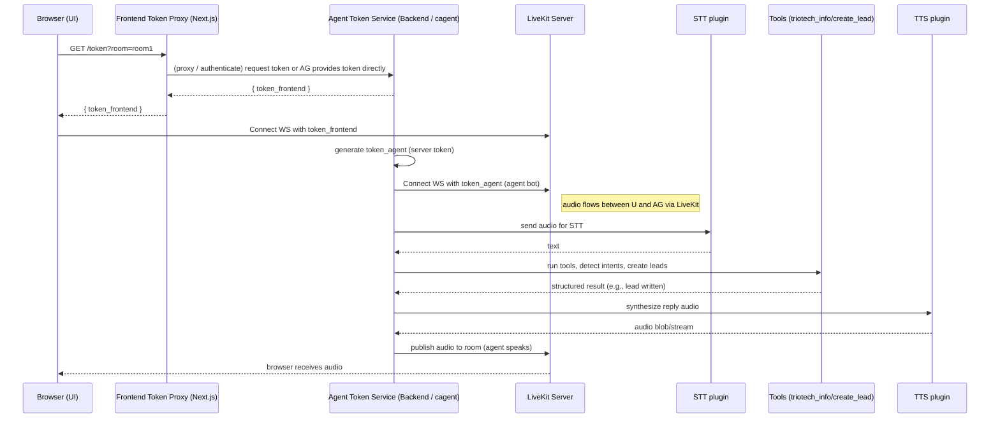
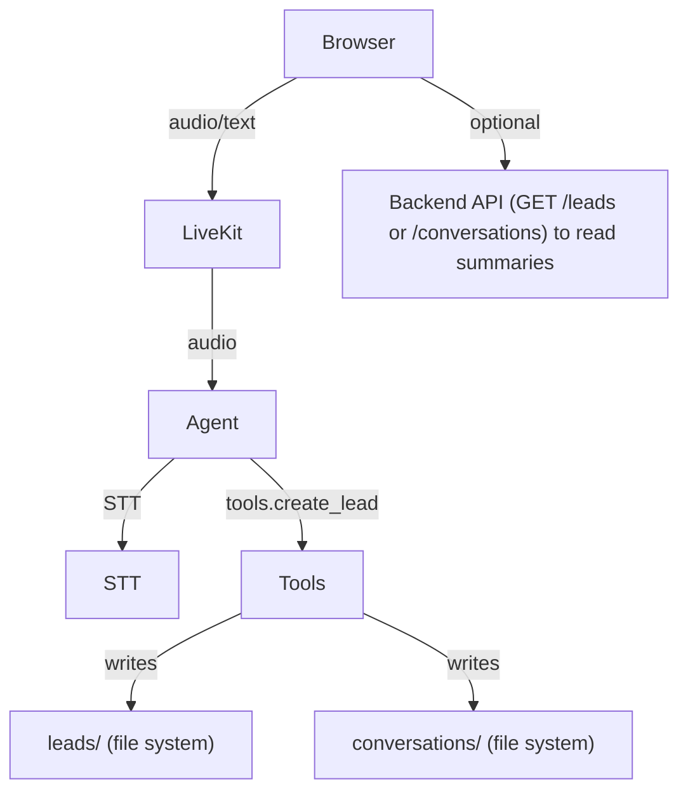
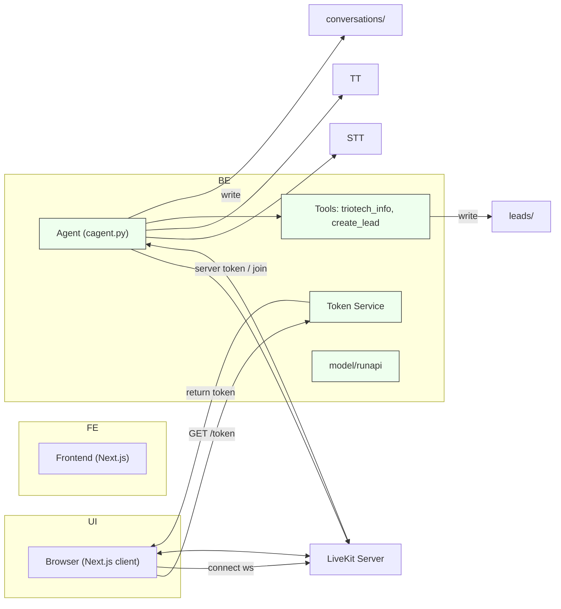

# Frontend ↔ Backend Integration — Friday Project

This document compares the frontend (`friday-frontend`) architecture with the backend/agent architecture (described in `REPO_ARCHITECTURE.md`) and describes how the two systems connect, exchange data, and collaborate at runtime. It contains mapping tables, end-to-end flows, Mermaid diagrams, security recommendations, and suggested integration improvements.

---

## Executive summary

- The frontend (Next.js app) provides the user interface and a short-lived token mint endpoint (`/api/livekit/token`) for LiveKit sessions. It renders the `VoiceAssistant` UI which connects to LiveKit and mounts the LiveKit components for audio rendering and controls.
- The backend (agent) is responsible for running the conversational AI (cagent.py), business tools (`tools.py`), RAG API (`model/runapi.py`), lead creation logic, and plugin adapters (STT/TTS and LiveKit bot integration).
- Integration pattern: both systems participate in the same LiveKit ecosystem. The browser (frontend) and the agent (backend) should each obtain valid LiveKit tokens and connect to the same room. The agent handles speech processing (STT), tooling, and lead/log persistence, while the frontend handles UI and direct user audio capture/playback.

High-level connection choices (two recommended patterns):
- Pattern A (recommended): Backend (agent) is the canonical token-mint authority and bot participant. Frontend requests a token from the backend (or a dedicated token service) and uses it to connect. Agent uses its own server token to join rooms as a bot.
- Pattern B (current lightweight): Frontend mints tokens using `LIVEKIT_API_KEY`/`SECRET` in Next API. Backend uses its own `generate_livekit_token.py` to mint a separate token for the agent bot. This works but requires secure coordination of secrets and key rotation.

---

## Mapping: frontend ↔ backend responsibilities

Table: key responsibilities and file mapping (frontend) vs backend (agent)

- Frontend (friday-frontend):
  - UI & client runtime: `src/app/layout.tsx`, `src/app/page.tsx`
  - LiveKit client & UI: `src/components/voice-assistant.tsx` (uses `@livekit/components-react`)
  - Token mint endpoint (small server piece): `src/app/api/livekit/token/route.ts`
  - UI primitives: `src/components/ui/*`, `src/lib/utils.ts`

- Backend (agent repository root, per `REPO_ARCHITECTURE.md`):
  - Agent runtime: `cagent.py` (session manager, plugin loader)
  - Business tools: `tools.py` (triotech_info, create_lead, detect_lead_intent)
  - RAG API / vector DB: `model/runapi.py`, `model/build_db.py`
  - LiveKit helpers (scripts): `generate_livekit_token.py` and plugin stubs under `backup_plugin_modifications/`
  - Persistence: `conversations/` and `leads/` directories

Integration surfaces (where these overlap):
- LiveKit rooms: both the browser and the agent bot connect to LiveKit rooms. Audio flows through LiveKit.
- Tokens: both need properly minted JWT tokens (signed with the LiveKit API secret and containing appropriate grants).
- Leads & conversation logs: agent writes leads and conversations; frontend can optionally read or call agent APIs to show or fetch leads/conversation summaries.

---

## End-to-end flows (text + mermaid)

Below are the common end-to-end scenarios and the exact responsibilities of each side.

### Flow 1 — User joins and agent bot joins same room (real-time voice assistant)

Textual steps (recommended Pattern A):
1. Browser requests a LiveKit token from the backend token service: `GET /backend/api/token?room=roomName`.
2. Backend validates caller (optional auth), mints token with `LIVEKIT_API_KEY`/`SECRET`, and returns { token, identity }.
3. Browser connects to LiveKit server (WS/WSS) using the token.
4. Backend agent obtains a separate server token (or uses the same token service) and connects to LiveKit as a bot participant in the same room.
5. LiveKit routes audio streams between browser and agent bot.
6. Agent receives audio and sends it to STT plugin -> text.
7. Agent calls `detect_lead_intent()` / `tools.triotech_info()` / RAG as required and decides next action.
8. Agent writes conversation/lead to `conversations/` and `leads/` and, if needed, uses TTS plugin to synthesize audio.
9. Agent publishes generated audio back into LiveKit. Browser hears the response.

Mermaid sequence (Pattern A):

Notes on Pattern B (current project state): frontend mints tokens directly using its Next API `/api/livekit/token`. In that case the agent should still independently mint its own server token and join the LiveKit room. Pattern B works but has more operational surface area for secret handling.

### Flow 2 — Lead capture vs UI-driven actions

Mermaid flow showing how lead creation and logs are written and can be surfaced to the frontend

Notes:
- The backend persists canonical leads and conversations to local files (per `REPO_ARCHITECTURE.md`). If you want the frontend to display leads, add read-only backend endpoints (e.g., `GET /api/leads?limit=10`) that safely surface sanitized lead summaries.

---

## Data contracts and token handling

- Token response (both sides): { token: string, identity: string }
- Token grants: server should include `roomJoin` and optionally `room` claim to scope the token to a specific room.
- TTL: default 3600s on frontend token endpoint. Consider shorter TTLs for security-sensitive deployments.

Recommendations for token management:
- Keep `LIVEKIT_API_SECRET` only on systems that must mint tokens (prefer backend agent and a single token service). Avoid storing the same secret in several places (e.g., Next.js and backend) when possible.
- If the Next.js API remains the token endpoint, restrict access to that endpoint (CORS, auth) and ensure only the frontend can call it — or better: make the backend the canonical token service and have the frontend call it.
- For server-side bots (agent), always mint tokens server-side and join with server credentials — do not reuse browser tokens for bot actions.

---

## Security & operational concerns

1. Secret management
   - Where the LiveKit secret exists matters. Prefer a single authoritative token-minting service running in the backend (or a secret-managed microservice). Avoid duplicating the secret inside the frontend codebase.

2. Authentication & authorization
   - For production, consider authenticating the token request (so arbitrary visitors cannot mint tokens and join rooms).
   - Optionally scope tokens to pre-authorized rooms and users.

3. Token expiry and rejoin
   - Implement token refresh or rejoin logic in the client and the agent bot. If a token expires mid-session, the participant must reconnect with a fresh token.

4. Data privacy
   - Conversation logs and leads contain PII. Protect filesystem permissions and consider encrypting data at rest or moving to a secure DB.

5. Scaling
   - LiveKit can scale horizontally; ensure token service and agent instances coordinate room assignment if you run multiple agents.

---

## Practical integration checklist (minimum changes to make things robust)

1. Decide token authority
   - Option A (recommended): Move `/api/livekit/token` implementation to the backend agent (expose a secure token endpoint) and remove secrets from Next.js. The Next.js app will call the backend token API.
   - Option B (keep current): Keep Next.js token route, but rotate secrets and restrict access. The backend uses its own token script for the agent.

2. Add agent join workflow
   - Ensure `cagent.py` or a small agent-runner uses `generate_livekit_token.py` to join a room when conversation starts (or is invited), and that agent listens to audio and responds.

3. Add backend HTTP endpoints for read-only data
   - `GET /api/leads` — return the latest leads (sanitized)
   - `GET /api/conversations?limit=10` — return conversation summaries

4. Improve error handling & UX
   - Frontend: surface token fetch failures and auto-retry with exponential backoff.
   - Backend: log STT/TTS errors and send telemetry/metrics.

5. Add tests
   - Unit test token minting (both frontend Next route and backend `generate_livekit_token.py`), test that tokens decode and include expected claims.
   - Integration test: run a local LiveKit instance or use a test environment, verify that browser and agent can join the same room and audio flows.

---

## Recommended architecture diagram (final-state, Pattern A)

---

## Short FAQ

- Q: Should I let the frontend mint tokens? A: For dev it's fine; for production prefer a single backend token authority with authentication.
- Q: How does the agent hear the user? A: Agent joins the same LiveKit room as a bot participant and receives the audio streams routed by LiveKit, then sends them to STT.
- Q: Where are leads stored? A: On the backend in `leads/lead_timestamp.json` files as described in `REPO_ARCHITECTURE.md`.

---

## Next steps I can implement for you

- Move token minting to the backend and update the frontend token call. I can make the minimal edits to the Next API to proxy to backend or remove secret usage and modify the backend to export a secure token endpoint.
- Add a small `GET /api/leads` endpoint in the backend that the Next frontend can call to display recent leads.
- Implement a simple smoke integration test: spawn a headless LiveKit (or use test LiveKit), mint tokens for frontend + agent and assert both can establish connections.

Tell me which of the next steps you'd like me to implement and I'll update the code and run tests where possible.
