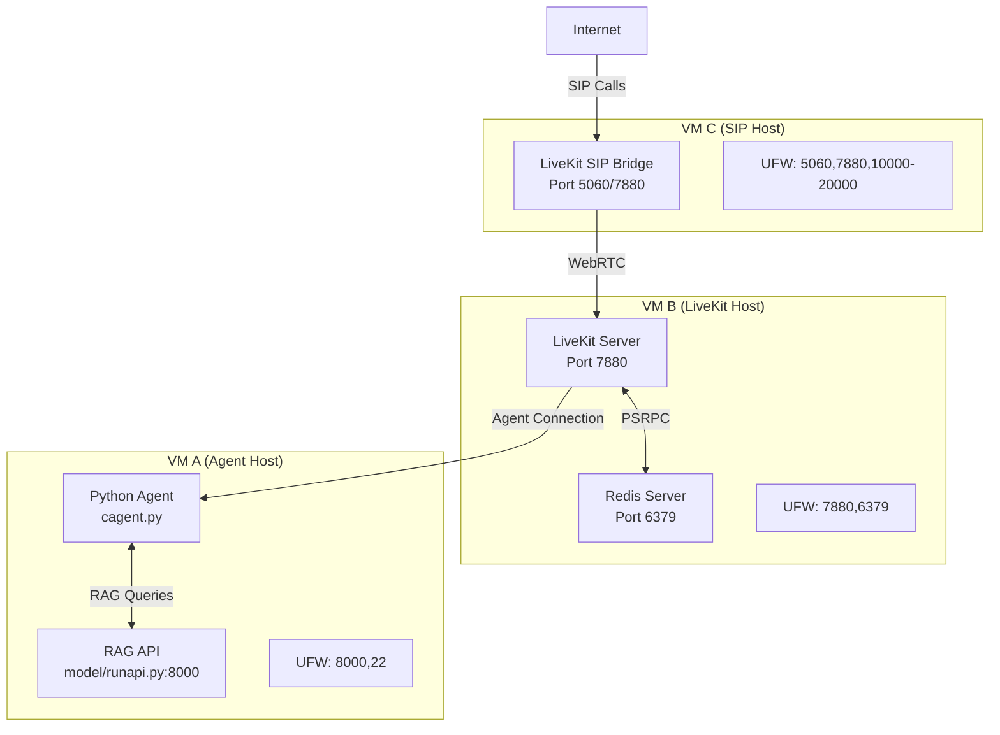

# Multi-VM Production Deployment Guide

## Architecture Overview

Production Friday AI deployment across 3 Ubuntu 22.04 VMs for optimal performance and scalability:



## Prerequisites

**All VMs:**
- Ubuntu 22.04 LTS
- 2+ GB RAM, 20+ GB disk
- Unique static IP addresses
- SSH access configured

**Network Requirements:**
- VM A→B: Port 7880 (LiveKit WebSocket)
- VM B→C: Port 6379 (Redis), Port 7880 (LiveKit)  
- Internet→C: Port 5060 (SIP), Ports 10000-20000 (RTP)

## VM A Setup (Agent Host)

### 1. System Preparation
```bash
# Update system
sudo apt update && sudo apt upgrade -y

# Install Python 3.10 and dependencies
sudo apt install -y python3.10 python3.10-venv python3.10-dev python3-pip git curl

# Create service user
sudo useradd -r -s /bin/bash -d /opt/friday friday
sudo mkdir -p /opt/friday
sudo chown friday:friday /opt/friday
```

### 2. Application Setup
```bash
# Switch to service user
sudo -u friday bash
cd /opt/friday

# Clone repository
git clone https://github.com/yourusername/friday-ai.git .

# Setup Python environment
python3.10 -m venv venv
source venv/bin/activate
pip install --upgrade pip
pip install -r requirements.txt

# Build RAG database
python model/build_db.py
```

### 3. Configuration
```bash
# Create config override
cat > /opt/friday/config_production.py << 'EOF'
# Production configuration overrides
LIVEKIT_URL = "ws://VM_B_IP:7880"  # Replace VM_B_IP
LIVEKIT_API_KEY = "APIntavBoHTqApw"
LIVEKIT_API_SECRET = "pRkd..."  # Your actual secret

# Paths
CONVERSATION_LOG_DIR = "/opt/friday/conversations"
LEADS_DIR = "/opt/friday/leads"
MODEL_DIR = "/opt/friday/model"

# RAG API
RAG_API_URL = "http://127.0.0.1:8000"
EOF
```

### 4. Systemd Services

**Agent Service:**
```bash
sudo tee /etc/systemd/system/friday-agent.service << 'EOF'
[Unit]
Description=Friday AI Voice Agent
After=network.target
Wants=friday-rag.service

[Service]
Type=simple
User=friday
WorkingDirectory=/opt/friday
Environment=PATH=/opt/friday/venv/bin
Environment=PYTHONPATH=/opt/friday
ExecStart=/opt/friday/venv/bin/python cagent.py
Restart=always
RestartSec=5
StandardOutput=journal
StandardError=journal

[Install]
WantedBy=multi-user.target
EOF
```

**RAG API Service:**
```bash
sudo tee /etc/systemd/system/friday-rag.service << 'EOF'
[Unit]
Description=Friday AI RAG API
After=network.target

[Service]
Type=simple
User=friday
WorkingDirectory=/opt/friday/model
Environment=PATH=/opt/friday/venv/bin
Environment=PYTHONPATH=/opt/friday
ExecStart=/opt/friday/venv/bin/python runapi.py
Restart=always
RestartSec=5
StandardOutput=journal
StandardError=journal

[Install]
WantedBy=multi-user.target
EOF
```

### 5. Firewall Configuration
```bash
# Configure UFW
sudo ufw --force enable
sudo ufw default deny incoming
sudo ufw default allow outgoing

# SSH access
sudo ufw allow 22/tcp

# RAG API (if external access needed)
sudo ufw allow 8000/tcp

# LiveKit server connection (outbound only)
sudo ufw allow out 7880/tcp
```

### 6. Service Management
```bash
# Enable and start services
sudo systemctl daemon-reload
sudo systemctl enable friday-rag friday-agent
sudo systemctl start friday-rag friday-agent

# Check status
sudo systemctl status friday-rag friday-agent
```
```bash
# Create environment file
cat > .env << 'EOF'
GOOGLE_API_KEY=your_google_api_key_here
HUGGINGFACE_API_KEY=your_huggingface_api_key_here
LIVEKIT_API_KEY=APIntavBoHTqApw
LIVEKIT_API_SECRET=pRkd16t4uYVUs9nSlNeMawSE1qmUzfV2ZkSrMT2aiFM
LLM_MODEL=gemini-2.5-flash
LIVEKIT_WS_URL=ws://VM_B_PRIVATE_IP:7880
EOF

# Replace VM_B_PRIVATE_IP with actual private IP of VM B
sed -i 's/VM_B_PRIVATE_IP/ACTUAL_VM_B_IP/g' .env
```

### Build Knowledge Base
```bash
# Build vector database
source venv/bin/activate
python model/build_db.py
```

### Service Configuration
```bash
# Create systemd service for agent
sudo tee /etc/systemd/system/friday-agent.service << EOF
[Unit]
Description=Friday AI Voice Agent
After=network.target
Wants=network-online.target

[Service]
Type=simple
User=$USER
Group=$USER
WorkingDirectory=/opt/friday-ai
ExecStart=/opt/friday-ai/venv/bin/python cagent.py
Restart=always
RestartSec=10
Environment=PATH=/opt/friday-ai/venv/bin:/usr/local/bin:/usr/bin:/bin

[Install]
WantedBy=multi-user.target
EOF

# Create systemd service for RAG API
sudo tee /etc/systemd/system/friday-rag.service << EOF
[Unit]
Description=Friday AI RAG API
After=network.target

[Service]
Type=simple
User=$USER
Group=$USER
WorkingDirectory=/opt/friday-ai
ExecStart=/opt/friday-ai/venv/bin/python model/runapi.py
Restart=always
RestartSec=5
Environment=PATH=/opt/friday-ai/venv/bin:/usr/local/bin:/usr/bin:/bin

[Install]
WantedBy=multi-user.target
EOF

# Enable and start services
sudo systemctl daemon-reload
sudo systemctl enable friday-agent friday-rag
```

### Firewall Configuration
```bash
sudo ufw enable
sudo ufw allow 22/tcp          # SSH
sudo ufw allow 5000/tcp        # RAG API (optional)
```

## VM B - LiveKit Host Setup

### Prerequisites
```bash
# Update system
sudo apt update && sudo apt upgrade -y

# Install dependencies
sudo apt install -y redis-server wget curl
```

### Redis Configuration
```bash
# Configure Redis for network access
sudo cp /etc/redis/redis.conf /etc/redis/redis.conf.backup

# Edit Redis config to bind to private IP
VM_B_PRIVATE_IP="YOUR_VM_B_PRIVATE_IP"
sudo sed -i "s/bind 127.0.0.1 ::1/bind $VM_B_PRIVATE_IP 127.0.0.1 ::1/" /etc/redis/redis.conf

# Enable and start Redis
sudo systemctl enable redis-server
sudo systemctl start redis-server

# Verify Redis
redis-cli -h $VM_B_PRIVATE_IP ping  # Should return PONG
```

### LiveKit Server Installation
```bash
# Install LiveKit server
curl -sSL https://get.livekit.io | bash

# Create LiveKit configuration
VM_B_PRIVATE_IP="YOUR_VM_B_PRIVATE_IP"
cat > /opt/livekit.yaml << EOF
port: 7880
bind_addresses:
  - 0.0.0.0
keys:
  APIntavBoHTqApw: pRkd16t4uYVUs9nSlNeMawSE1qmUzfV2ZkSrMT2aiFM
redis:
  address: '$VM_B_PRIVATE_IP:6379'
  db: 0
turn:
  enabled: true
  domain: $VM_B_PRIVATE_IP
  tls_port: 5349
  udp_port: 3478
EOF
```

### Service Configuration
```bash
# Create systemd service for LiveKit server
sudo tee /etc/systemd/system/livekit-server.service << 'EOF'
[Unit]
Description=LiveKit Server
After=network.target redis-server.service
Requires=redis-server.service

[Service]
Type=simple
User=root
WorkingDirectory=/opt
ExecStart=/usr/local/bin/livekit-server --config /opt/livekit.yaml
Restart=always
RestartSec=5
LimitNOFILE=65536

[Install]
WantedBy=multi-user.target
EOF

# Enable and start services
sudo systemctl daemon-reload
sudo systemctl enable livekit-server
sudo systemctl start livekit-server
```

### Firewall Configuration
```bash
sudo ufw enable
sudo ufw allow 22/tcp                    # SSH
sudo ufw allow 7880/tcp                  # LiveKit WebSocket
sudo ufw allow 7881/tcp                  # LiveKit TCP
sudo ufw allow 50000:60000/udp          # LiveKit RTP
sudo ufw allow from VM_A_PRIVATE_IP to any port 6379  # Redis from Agent VM
sudo ufw allow from VM_C_PRIVATE_IP to any port 6379  # Redis from SIP VM
sudo ufw allow from VM_A_PRIVATE_IP to any port 7880  # LiveKit from Agent VM
sudo ufw allow from VM_C_PRIVATE_IP to any port 7880  # LiveKit from SIP VM
```

## VM C - SIP Host Setup

### Prerequisites
```bash
# Update system
sudo apt update && sudo apt upgrade -y

# Install Go for building SIP bridge
sudo apt install -y golang-go git wget curl
```

### LiveKit SIP Bridge Installation
```bash
# Build SIP bridge from source
git clone https://github.com/livekit/livekit-sip.git /tmp/livekit-sip
cd /tmp/livekit-sip
go build -o livekit-sip ./cmd/livekit-sip
sudo mv livekit-sip /usr/local/bin/

# Create SIP configuration directory
sudo mkdir -p /opt/sip-setup
```

### SIP Configuration
```bash
# Create SIP bridge configuration
VM_B_PRIVATE_IP="YOUR_VM_B_PRIVATE_IP"
VM_C_PUBLIC_IP="YOUR_VM_C_PUBLIC_IP"

cat > /opt/sip-setup/config.yaml << EOF
api_key: APIntavBoHTqApw
api_secret: pRkd16t4uYVUs9nSlNeMawSE1qmUzfV2ZkSrMT2aiFM
ws_url: ws://$VM_B_PRIVATE_IP:7880
redis:
  address: $VM_B_PRIVATE_IP:6379
sip_port: 5060
rtp_port: 10000-20000
use_external_ip: true
logging:
  level: info
EOF

# Create SIP trunk configuration
cat > /opt/sip-setup/inbound_trunk.json << 'EOF'
{
  "trunk": {
    "name": "Production Inbound Trunk",
    "auth_username": "1001",
    "auth_password": "1001"
  }
}
EOF

# Create SIP dispatch configuration template
cat > /opt/sip-setup/sip_dispatch.json << 'EOF'
{
  "dispatch_rule": {
    "name": "Production Dispatch Rule",
    "trunk_ids": ["REPLACE_WITH_TRUNK_ID"],
    "rule": {
      "dispatchRuleDirect": {
        "roomName": "friday-assistant-room"
      }
    }
  }
}
EOF
```

### Service Configuration
```bash
# Create systemd service for SIP bridge
sudo tee /etc/systemd/system/livekit-sip.service << 'EOF'
[Unit]
Description=LiveKit SIP Bridge
After=network.target
Wants=network-online.target

[Service]
Type=simple
User=root
WorkingDirectory=/opt/sip-setup
ExecStart=/usr/local/bin/livekit-sip --config /opt/sip-setup/config.yaml
Restart=always
RestartSec=5
LimitNOFILE=65536

[Install]
WantedBy=multi-user.target
EOF

# Enable service (don't start yet - need LiveKit project setup first)
sudo systemctl daemon-reload
sudo systemctl enable livekit-sip
```

### Firewall Configuration
```bash
sudo ufw enable
sudo ufw allow 22/tcp           # SSH
sudo ufw allow 5060            # SIP signaling (TCP & UDP)
sudo ufw allow 10000:20000/udp # RTP media ports
```

## LiveKit Project Setup

### Install LiveKit CLI (run on VM C or any VM with network access)
```bash
# Install LiveKit CLI
curl -sSL https://get.livekit.io/cli | sudo bash
```

### Create LiveKit Project and SIP Resources
```bash
# Configure LiveKit project
VM_B_PRIVATE_IP="YOUR_VM_B_PRIVATE_IP"
lk project add friday --url ws://$VM_B_PRIVATE_IP:7880 --api-key APIntavBoHTqApw --api-secret pRkd16t4uYVUs9nSlNeMawSE1qmUzfV2ZkSrMT2aiFM
lk project set-default friday

# Create SIP inbound trunk
cd /opt/sip-setup
TRUNK_ID=$(lk sip inbound create --project friday inbound_trunk.json | grep "SIPTrunkID:" | awk '{print $2}')
echo "Created trunk with ID: $TRUNK_ID"

# Update dispatch rule with trunk ID
sed -i "s/REPLACE_WITH_TRUNK_ID/$TRUNK_ID/g" sip_dispatch.json

# Create dispatch rule
lk sip dispatch create --project friday sip_dispatch.json

# Verify setup
lk sip inbound-trunk list
lk sip dispatch list
```

## Service Startup and Verification

### Start All Services
```bash
# On VM B (LiveKit Host)
sudo systemctl start livekit-server

# On VM C (SIP Host)
sudo systemctl start livekit-sip

# On VM A (Agent Host)
sudo systemctl start friday-agent
sudo systemctl start friday-rag
```

### Verification Commands

#### Check Service Status
```bash
# On VM A
sudo systemctl status friday-agent friday-rag

# On VM B
sudo systemctl status livekit-server redis-server

# On VM C
sudo systemctl status livekit-sip
```

#### Test Connectivity
```bash
# Test Redis connectivity from VM A and VM C
redis-cli -h VM_B_PRIVATE_IP ping  # Should return PONG

# Test LiveKit connectivity
lk room list  # Should show empty list or existing rooms

# Check if agent joined the room (after a test call)
lk room participants --room friday-assistant-room
```

#### Monitor Logs
```bash
# LiveKit server logs (VM B)
sudo journalctl -u livekit-server -f

# SIP bridge logs (VM C)
sudo journalctl -u livekit-sip -f

# Agent logs (VM A)
sudo journalctl -u friday-agent -f
```

### SIP Client Testing

#### Configure Zoiper
- **Host**: VM_C_PUBLIC_IP
- **Port**: 5060
- **Username**: 1001
- **Password**: 1001
- **Transport**: UDP or TCP

#### Test Call Flow
1. Register Zoiper with VM C
2. Dial any number from Zoiper
3. Call should connect to friday-assistant-room
4. Agent should respond with Hinglish greeting
5. Verify conversation logging on VM A

## Monitoring and Maintenance

### Log Rotation Setup (on VM A)
```bash
sudo tee /etc/logrotate.d/friday-ai << 'EOF'
/opt/friday-ai/conversations/*.json /opt/friday-ai/leads/*.json {
    weekly
    rotate 12
    compress
    delaycompress
    missingok
    notifempty
    create 644 ubuntu ubuntu
}
EOF
```

### Backup Script (on VM A)
```bash
sudo tee /opt/friday-ai/backup.sh << 'EOF'
#!/bin/bash
BACKUP_DIR="/opt/backups/friday-ai"
DATE=$(date +%Y%m%d_%H%M%S)

mkdir -p $BACKUP_DIR
tar -czf $BACKUP_DIR/friday-ai-$DATE.tar.gz \
    -C /opt/friday-ai \
    conversations/ leads/ model/chroma_db/ \
    --exclude='*.log'

# Keep only last 30 days of backups
find $BACKUP_DIR -name "friday-ai-*.tar.gz" -mtime +30 -delete
EOF

chmod +x /opt/friday-ai/backup.sh

# Add to crontab for daily backups at 2 AM
(crontab -l 2>/dev/null; echo "0 2 * * * /opt/friday-ai/backup.sh") | crontab -
```

### Health Check Script
```bash
sudo tee /opt/friday-ai/health_check.sh << 'EOF'
#!/bin/bash

echo "=== Friday AI Health Check ==="
echo "Date: $(date)"
echo

# Check services
echo "Service Status:"
systemctl is-active friday-agent friday-rag

# Check connectivity
echo "Redis connectivity:"
redis-cli -h VM_B_PRIVATE_IP ping 2>/dev/null || echo "Redis connection failed"

# Check disk usage
echo "Disk usage:"
df -h /opt/friday-ai

# Check recent conversations
echo "Recent conversations:"
ls -la /opt/friday-ai/conversations/ | tail -5

# Check recent leads
echo "Recent leads:"
ls -la /opt/friday-ai/leads/ | tail -5
EOF

chmod +x /opt/friday-ai/health_check.sh
```

## Troubleshooting

### Common Issues

1. **Agent not connecting to LiveKit room**
   - Check LIVEKIT_WS_URL in .env points to VM B
   - Verify firewall allows VM A → VM B:7880
   - Check agent logs: `sudo journalctl -u friday-agent -f`

2. **SIP calls not connecting**
   - Verify SIP bridge logs: `sudo journalctl -u livekit-sip -f`
   - Check firewall allows UDP 5060 and 10000-20000
   - Use `sngrep` on VM C to monitor SIP traffic

3. **Redis connection issues**
   - Test from each VM: `redis-cli -h VM_B_PRIVATE_IP ping`
   - Check Redis config binds to private IP
   - Verify firewall allows VM A,C → VM B:6379

4. **Agent not responding to calls**
   - Check if agent joined room: `lk room participants --room friday-assistant-room`
   - Verify environment variables in .env
   - Check Python dependencies are installed

### Debug Commands
```bash
# Monitor all services
watch 'systemctl status friday-agent livekit-server livekit-sip --no-pager'

# Check network connectivity
ss -tulnp | grep -E "5060|7880|6379"

# Monitor SIP traffic
sudo apt install sngrep && sudo sngrep

# Check room status
lk room list
lk room participants --room friday-assistant-room
```

This completes the multi-VM deployment setup for Friday AI with production-ready configuration, monitoring, and troubleshooting procedures.