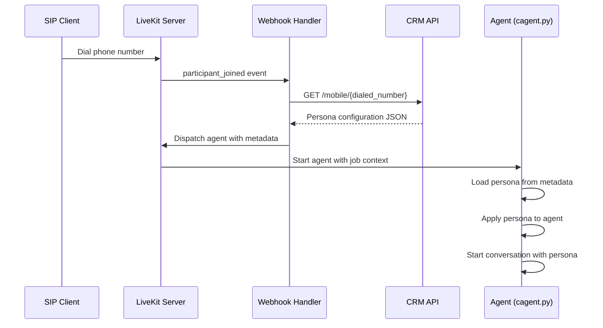
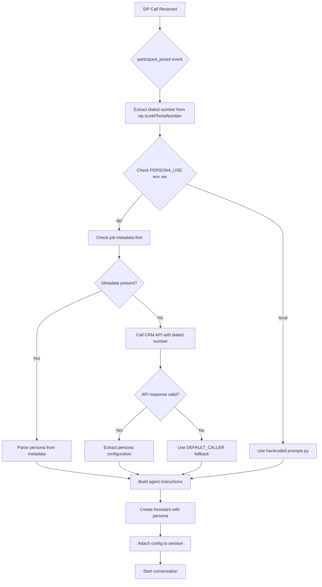
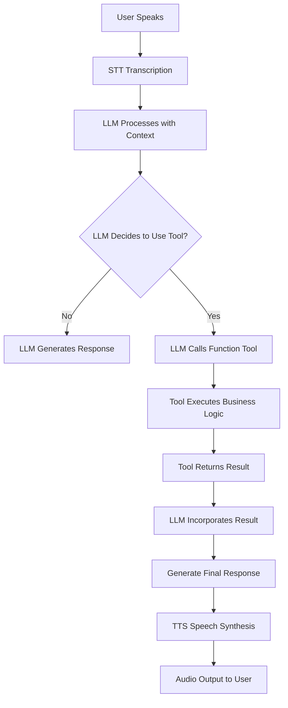
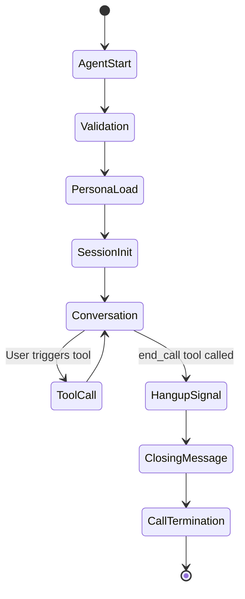

# Persona Loading System Documentation

## Overview

The Friday AI Voice Agent implements a sophisticated dynamic persona loading system that allows different personas to be loaded from a CRM API based on the dialed phone number. This system enables personalized conversations where each phone number can have its own agent personality, knowledge base, and conversation flow.

## Architecture Components

### 1. Webhook Handler (`handler.py`)

The webhook handler is a Flask service that listens for LiveKit participant_joined events and orchestrates the persona loading process.

**Key Functions:**

- `load_config_for_dialed_number()`: Fetches persona configuration from CRM API
- `dispatch_agent_to_room()`: Dispatches agent with configuration metadata
- `livekit_webhook()`: Main webhook endpoint processing participant events

**Workflow:**

1. Receives `participant_joined` event from LiveKit
2. Extracts dialed number from `sip.trunkPhoneNumber` attribute
3. Calls CRM API: `https://devcrm.xeny.ai/apis/api/public/mobile/{dialed_number}`
4. Dispatches agent to room with full configuration as JSON metadata

### 2. Persona Handler (`persona_handler.py`)

Central component that manages persona loading logic with multiple fallback strategies.

**Key Functions:**

- `load_persona_with_fallback()`: Main entry point with environment-controlled strategy
- `load_persona_from_metadata()`: Extracts persona from job metadata
- `load_persona_from_dialed_number()`: Fetches from CRM API using dialed number
- `apply_persona_to_agent()`: Applies persona instructions to agent
- `attach_persona_to_session()`: Attaches configuration to session

**Environment Configuration:**

- `PERSONA_USE=local`: Uses hardcoded prompts from `prompts.py`
- `PERSONA_USE=api`: Uses API-based loading (default)

### 3. Agent Core (`cagent.py`)

The main agent implementation that integrates persona loading with the LiveKit Agents framework.

**Key Components:**

- `Assistant` class: Extends LiveKit Agent with custom instructions and tools
- `entrypoint()` function: Main agent lifecycle management
- Persona integration: Loads and applies persona configuration
- Tool integration: Includes function tools for various capabilities

## Data Flow Architecture



## Detailed Persona Loading Flow



## Persona Configuration Structure

The CRM API returns a JSON structure with the following hierarchy:

```json
{
  "mobileNo": "8655701159",
  "campaigns": [
    {
      "voiceAgents": [
        {
          "persona": {
            "name": "Sales Agent",
            "personality": "Professional and helpful sales representative...",
            "conversationStructure": "1. Greeting 2. Needs assessment 3. Solution presentation...",
            "workflow": "Product knowledge base and sales processes...",
            "welcomeMessage": "Hello! I'm here to help you with our AI solutions.",
            "closingMessage": "Thank you for your interest. We'll follow up soon!",
            "fullConfig": {
              "messages": {
                "welcomeMessage": "Alternative welcome message",
                "closingMessage": "Alternative closing message"
              }
            }
          }
        }
      ]
    }
  ]
}
```

## How Persona Overwrites Local Prompts

### 1. Agent Instructions Override

**Local Default (`prompts.py`):**

```python
AGENT_INSTRUCTION = """
You are a helpful AI assistant...
"""
```

**Persona Override:**

```python
agent_instructions = f"""
# CORE IDENTITY & RULES
You are {persona_name}.
{personality}

# CONVERSATION STRUCTURE
You must follow these steps for structuring the conversation:
{conversation_structure}

# KNOWLEDGE BASE & WORKFLOW
You must use the following information to answer user questions. Do not use outside knowledge.
{workflow}

# DATA COLLECTION
If the conversation requires it, you can ask for the following data fields for lead generation...
"""
```

### 2. Session Instructions Override

**Local Default:**

```python
SESSION_INSTRUCTION = "Greet the user and ask how you can help them."
```

**Persona Override:**

```python
session_instructions = f"Start the conversation by delivering your welcome message: '{welcome_message}'"
```

### 3. Closing Message Override

**Local Default:** None
**Persona Override:** Custom closing message from `persona.closingMessage`

## Function Tools and Call Process

### Tool Registration

Tools are registered in the `Assistant` class constructor:

```python
class Assistant(Agent):
    def __init__(self, custom_instructions=None, end_call_tool=None):
        super().__init__(
            instructions=custom_instructions,
            tools=[
                get_weather,           # Weather information
                search_web,            # Web search capability
                triotech_info,         # Product knowledge (hybrid JSON + RAG)
                create_lead,           # Lead creation and validation
                detect_lead_intent,    # Lead opportunity detection
                end_call_tool          # Call termination (HangupTool.end_call)
            ],
        )
```

### Tool Execution Flow



### Key Function Tools

#### 1. `get_weather(city: str)`

- **Purpose:** Provides current weather information
- **Implementation:** Calls wttr.in API
- **Usage:** `@function_tool() async def get_weather(city: str) -> str`

#### 2. `search_web(query: str)`

- **Purpose:** Web search using DuckDuckGo
- **Implementation:** LangChain DuckDuckGoSearchRun
- **Usage:** General information gathering

#### 3. `triotech_info(query: str)`

- **Purpose:** Hybrid knowledge system for Triotech products
- **Implementation:**
  - Basic queries: JSON lookup from `data/triotech_content.json`
  - Detailed queries: RAG system with ChromaDB vector search
- **Decision Logic:**

```python
detailed_keywords = ["detailed", "features", "how to", "integrate", ...]
is_detailed_query = any(keyword in query_lower for keyword in detailed_keywords)
```

#### 4. `create_lead(name, email, company, interest, ...)`

- **Purpose:** Lead capture and storage
- **Validation:** Email format, required fields
- **Storage:** MongoDB primary, JSON file fallback
- **Response:** Hindi confirmation message

#### 5. `detect_lead_intent(user_message: str)`

- **Purpose:** Analyze conversation for lead opportunities
- **Patterns:** Self-introduction, business interest, company mentions
- **Returns:** Guidance for lead qualification

#### 6. `HangupTool.end_call()`

- **Purpose:** Graceful call termination
- **Mechanism:** Sets asyncio.Event to signal hangup
- **Integration:** Blocks main agent loop until tool is called### Tool Calling Process

1. **LLM Decision:** Based on conversation context and persona instructions
2. **Tool Execution:** Async function call with parameters
3. **Result Integration:** LLM incorporates tool results into response
4. **State Management:** Tools can modify conversation state (leads, hangup events)

## Session Management and Logging

### Session Lifecycle



### Logging Architecture

- **Transcript Logging:** Real-time JSONL streaming to `conversations/transcripts.jsonl`
- **Session Snapshots:** Final state saved to `conversations/transcript_session_*.json`
- **Event Logging:** Structured events for persona loading, tool usage, hangup events
- **Background Processing:** Non-blocking logging via `transcript_logger.py`

## Configuration and Environment Variables

### Core Environment Variables

- `PERSONA_USE`: `"local"` or `"api"` (default: `"api"`)
- `DEFAULT_CALLER`: Fallback phone number for API calls
- `PERSONA_API_BASE`: CRM API base URL
- `TEST_API_RESPONSE_FILE`: Local file for testing persona responses

### LiveKit Integration

- `LIVEKIT_URL`: LiveKit server URL
- `LIVEKIT_API_KEY` & `LIVEKIT_API_SECRET`: Authentication
- `AGENT_TO_DISPATCH`: Agent name for webhook dispatch

### Tool-Specific Configuration

- `USE_MONGODB`: Enable MongoDB for lead storage
- `GOOGLE_API_KEY`: Required for RAG system
- `WEBHOOK_SECRET`: Optional webhook validation

## Error Handling and Fallbacks

### Persona Loading Fallbacks

1. **Primary:** Job metadata from webhook
2. **Secondary:** CRM API call with dialed number
3. **Tertiary:** CRM API call with `DEFAULT_CALLER`
4. **Final:** Local hardcoded prompts

### Tool Execution Resilience

- **Network Failures:** Graceful degradation with error messages
- **API Timeouts:** Configurable timeout with fallback responses
- **Data Validation:** Input validation before processing
- **Storage Failures:** MongoDB → JSON file fallback

### Agent Validation

- **Pre-call Validation:** `validate_agent_availability()` checks persona configuration
- **Unavailable State:** Polite rejection with apology message
- **Graceful Degradation:** Continues with local persona if API fails

## Testing and Development

### Test Files

- `test_handler.py`: Webhook handler and persona loading tests
- `test_integration.py`: End-to-end persona loading flow tests
- `test_tvenv_plugins.py`: Plugin functionality tests

### Testing Strategies

- **Unit Tests:** Individual function and tool testing
- **Integration Tests:** Full webhook-to-agent flow
- **Mock Data:** `TEST_API_RESPONSE_FILE` for deterministic testing
- **Environment Isolation:** Separate test and production configurations

This comprehensive system enables dynamic, personalized AI conversations where each phone number can have its own unique agent personality, knowledge base, and conversation flow, all orchestrated through the webhook-based persona loading architecture.



