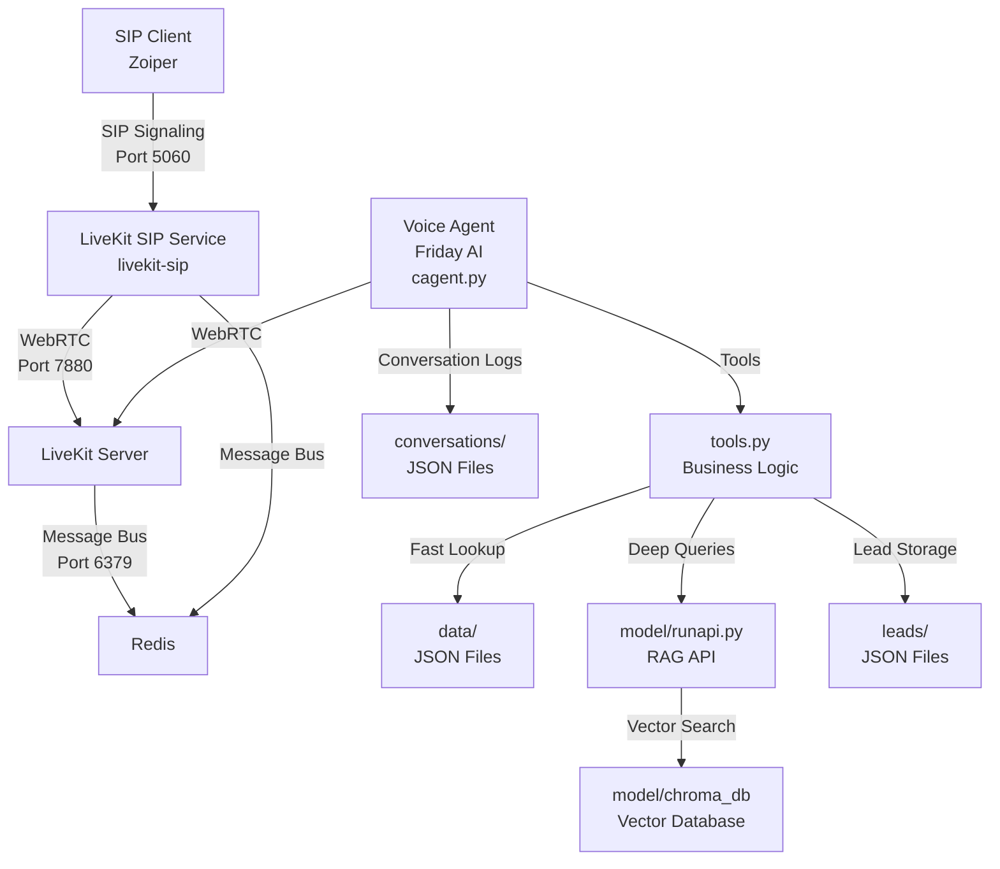
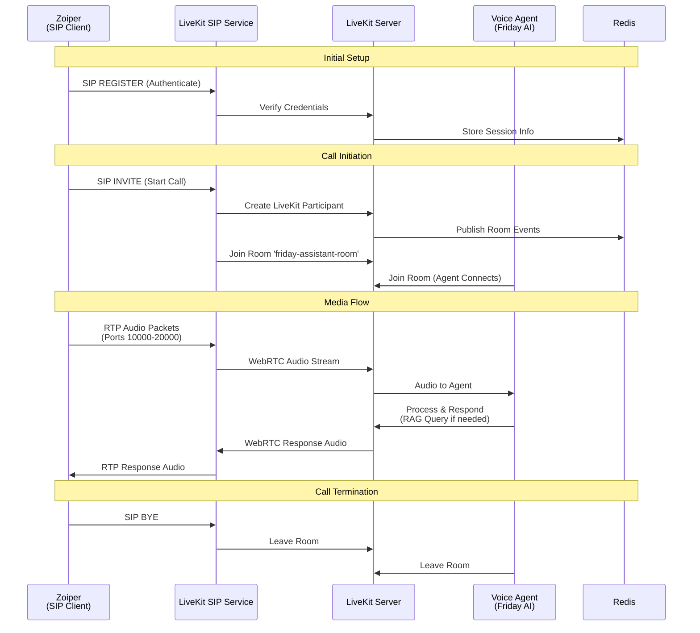
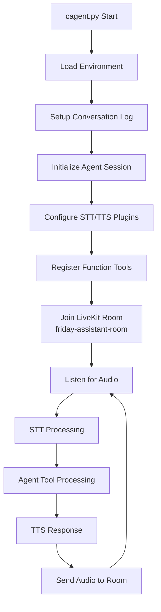
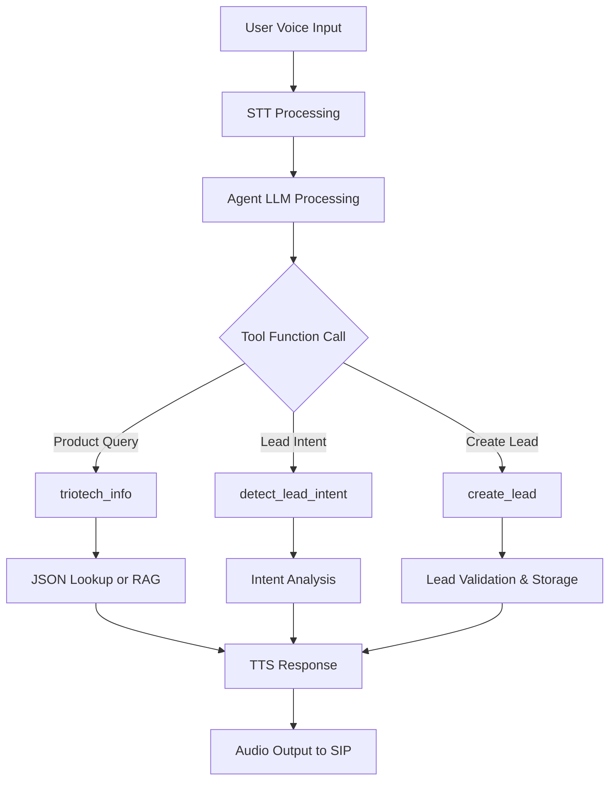
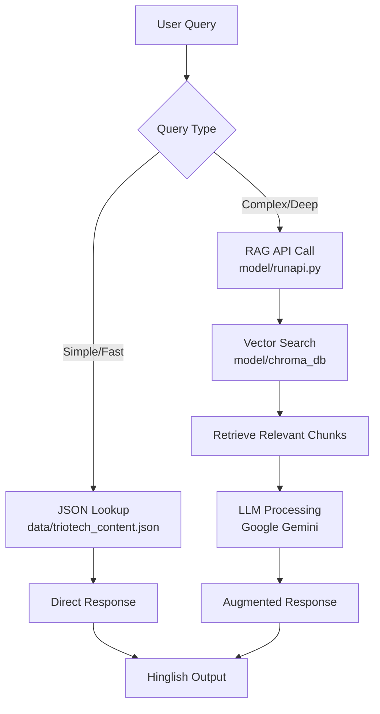
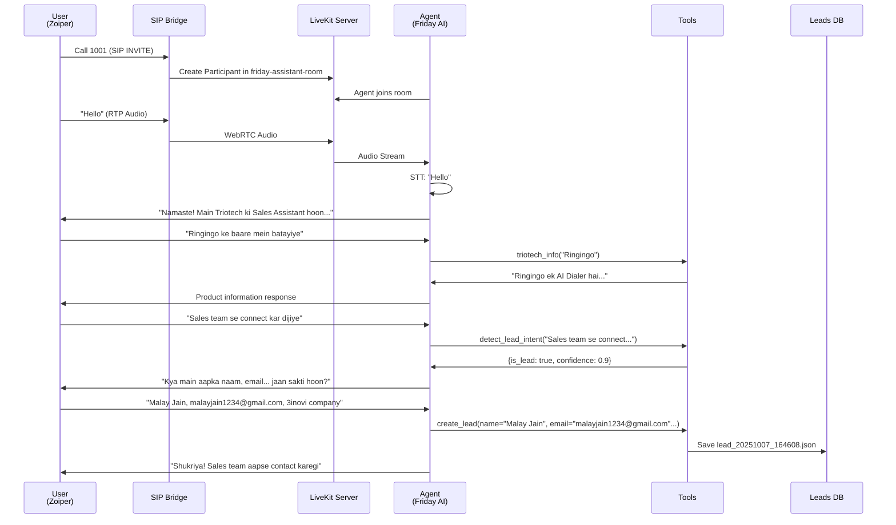

# Friday AI - Complete Backend Architecture: SIP → LiveKit → Agent

This document describes the complete Friday AI backend architecture including SIP telephony integration, LiveKit real-time communication, voice agent processing, and data flows. It serves as the definitive reference for developers working on the Friday AI system.

## 1. High-level Architecture Overview

Friday AI is a complete voice assistant system with SIP telephony integration, featuring:

- **SIP Telephony**: Zoiper/softphone → LiveKit SIP bridge → LiveKit server → Voice agent
- **Hybrid Knowledge**: Fast JSON lookup + RAG-powered vector database for complex queries  
- **Lead Capture**: Automatic lead detection, validation, and storage in Hinglish conversations
- **Real-time Voice**: STT → Agent processing → TTS with LiveKit WebRTC infrastructure
- **Conversation Logging**: Persistent conversation history with timestamps and lead tracking

### Core Components



### Service Architecture

- **LiveKit Server**: Core WebRTC service managing rooms, participants, and media tracks
- **LiveKit SIP Service**: SIP-to-WebRTC bridge handling phone call signaling and RTP conversion
- **Redis**: Message bus enabling communication between LiveKit server and SIP service
- **Voice Agent**: Python agent (`cagent.py`) joining LiveKit rooms for conversation processing
- **RAG System**: Vector database with embeddings for knowledge retrieval
- **Lead Management**: Automatic lead detection and JSON storage system

## 2. SIP Telephony Integration

### SIP Call Flow



### Configuration Requirements

**LiveKit Server** (`livekit.yaml`):
```yaml
port: 7880
bind_addresses:
  - 0.0.0.0
keys:
  APIntavBoHTqApw: pRkd16t4uYVUs9nSlNeMawSE1qmUzfV2ZkSrMT2aiFM
redis:
  address: '192.168.109.66:6379'
  db: 0
```

**SIP Service** (`sip-setup/config.yaml`):
```yaml
api_key: APIntavBoHTqApw
api_secret: pRkd16t4uYVUs9nSlNeMawSE1qmUzfV2ZkSrMT2aiFM
ws_url: ws://192.168.109.66:7880
redis:
  address: 192.168.109.66:6379
sip_port: 5060
rtp_port: 10000-20000
use_external_ip: false
logging:
  level: debug
```

**Critical Setup Commands**:
```bash
# Start services in order
redis-cli ping                                    # verify Redis
livekit-server --config livekit.yaml            # start main server
cd sip-setup && ./livekit-sip --config config.yaml    # start SIP bridge

# Setup SIP trunk and dispatch
lk project add friday --url ws://192.168.109.66:7880 --api-key APIntavBoHTqApw --api-secret pRkd16t4uYVUs9nSlNeMawSE1qmUzfV2ZkSrMT2aiFM
lk sip inbound create --project friday inbound_trunk.json
lk sip dispatch create --project friday sip_dispatch.json

# Start voice agent
python cagent.py
```

### Automating SIP Trunk & Dispatch creation

To avoid manual copy/paste when creating SIP trunks and dispatch rules, use the `lk` CLI and parse its JSON output with `jq`. Example (run from repository root where `sip-setup/` lives):

```bash
# Create inbound trunk and capture its ID
TRUNK_ID=$(lk sip inbound create --project friday sip-setup/inbound_trunk.json | jq -r '.sip_trunk_id')

# Replace placeholder in dispatch JSON and create the dispatch rule
sed -i "s/REPLACE_WITH_TRUNK_ID/$TRUNK_ID/g" sip-setup/sip_dispatch.json
lk sip dispatch create --project friday sip-setup/sip_dispatch.json
```

This follows the canonical pattern in `README.md` and prevents human error during provisioning.

### Start services (development)

For local development, use `screen` to run services detached. For production prefer systemd or container orchestration.

```bash
screen -dmS livekit-server livekit-server --config sip-setup/livekit.yaml
screen -dmS sip-bridge livekit-sip --config sip-setup/config.yaml
screen -dmS friday-agent bash -c "source ainvenv/bin/activate && python cagent.py"
```

## 3. Voice Agent Core (cagent.py)

The voice agent is the central component that connects to LiveKit rooms and processes conversations.

### Agent Session Flow



### Key Components

- **Agent Session**: Manages LiveKit connection, room participation, and audio processing
- **STT/TTS Plugins**: Deepgram for speech-to-text, Cartesia for text-to-speech (Hindi voice)
- **Function Tools**: Business logic tools registered with `@function_tool()` decorator
- **Conversation Logging**: All interactions saved to `conversations/conversation_YYYYMMDD_HHMMSS.json`

### Agent Configuration
```python
# Agent initialization in cagent.py
session = AgentSession(
    stt=deepgram.STT(model="nova-3", language="multi"),
    llm=google.LLM(model="gemini-2.5-flash", temperature=0.8),
    tts=cartesia.TTS(
        model="sonic-2",
        language="hi",
        voice="f91ab3e6-5071-4e15-b016-cde6f2bcd222",
    ),
    vad=silero.VAD.load(),
)
```

## 4. Business Logic Tools (tools.py)

Core business logic functions exposed to the agent via `@function_tool()` decorator pattern.

### Tool Functions

**triotech_info(query: str) → str**
- **Purpose**: Handles product and company information queries
- **Flow**: Fast JSON lookup in `data/` → RAG fallback for complex queries
- **Implementation**:
  - Check keywords: "features", "how to", "api", "integrate" → use RAG
  - Simple product queries → return JSON snippet
  - Fallback → call `model/runapi.py` for vector search

**detect_lead_intent(text: str) → dict**
- **Purpose**: Detects if user message indicates sales interest
- **Output**: `{is_lead: bool, confidence: float, extracted_fields: dict}`
- **Triggers**: Keywords like "interested", "price", "demo", "sales team"

**create_lead(name, email, company, interest, phone=None, budget=None) → str**
- **Purpose**: Validates and stores lead information
- **Validation**: Required fields present, email format check
- **Storage**: `leads/lead_YYYYMMDD_HHMMSS.json` with English keys
- **Response**: Hinglish confirmation message

### Tool Integration Flow



## 5. RAG System Architecture (model/)

Hybrid knowledge retrieval system combining fast JSON lookups with vector database search.

### RAG Components

**Vector Database Build** (`model/build_db.py`):
- Chunks knowledge documents (chunk_size=1500, overlap=200)
- Uses HuggingFace embeddings for vector generation
- Builds persistent Chroma DB at `model/chroma_db/`
- Sources: `data/triotech_knowledge.txt` and other knowledge files

**RAG API Runtime** (`model/runapi.py`):
- Flask API server for RAG queries (port 5000)
- Handles vector similarity search
- LLM integration with API key rotation
- Fallback handling for ResourceExhausted errors

### RAG Query Flow



### Knowledge Sources
- `data/triotech_content.json`: Fast lookup for basic product info
- `data/triotech_knowledge.txt`: Deep knowledge for RAG processing
- Vector embeddings optimized for technical queries about features, APIs, integration

### API Key Management
- Automatic rotation on ResourceExhausted errors
- Environment variable configuration
- Fallback to cached responses on API failures

## 6. Data Models and Storage

### Conversation Logging
**Format**: `conversations/conversation_YYYYMMDD_HHMMSS.json`
```json
{
  "conversation": [
    {
      "role": "user|agent",
      "content": "message text",
      "timestamp": "2025-10-07T16:42:56.532626",
      "source": "google_llm|cartesia_tts"
    }
  ]
}
```

### Lead Storage
**Format**: `leads/lead_YYYYMMDD_HHMMSS.json`
```json
{
  "timestamp": "2025-10-07T16:46:08.546889",
  "source": "Friday AI Assistant",
  "status": "new",
  "name": "Full Name",
  "email": "email@example.com",
  "company": "Company Name",
  "interest": "Product/Service",
  "phone": "phone number",
  "budget": "budget range",
  "job_title": "",
  "timeline": ""
}
```

**Key Conventions**:
- User-facing language: Hinglish (Hindi + English mix)
- Lead JSON fields: English only (for CRM integration)
- Timestamps: ISO 8601 format
- File naming: `YYYYMMDD_HHMMSS` pattern for chronological sorting

### Configuration Files

**Environment Variables** (`.env`):
- `GOOGLE_API_KEY`: For Gemini LLM
- `HUGGINGFACE_API_KEY`: For embeddings
- `LIVEKIT_API_KEY`/`LIVEKIT_API_SECRET`: For LiveKit tokens
- `LLM_MODEL`: Configurable model (default: "gemini-2.5-flash")

**SIP Configuration** (`sip-setup/inbound_trunk.json`):
```json
{
  "trunk": {
    "name": "Zoiper Local Inbound",
    "auth_username": "1001",
    "auth_password": "1001"
  }
}
```

**SIP Dispatch** (`sip-setup/sip_dispatch.json`):
```json
{
  "dispatch_rule": {
    "name": "Zoiper to Assistant Room Rule",
    "trunk_ids": ["ST_TRUNK_ID"],
    "rule": {
      "dispatchRuleDirect": {
        "roomName": "friday-assistant-room"
      }
    }
  }
}
```

## 7. Complete End-to-End Flow Example

### Real Call Session Example



### Directory Structure After Operation

```
Friday - Copy/
├── conversations/
│   └── conversation_20251007_164256.json    # Complete call transcript
├── leads/
│   └── lead_20251007_164608.json           # Extracted lead data
├── sip-setup/
│   ├── config.yaml                         # SIP bridge config
│   ├── inbound_trunk.json                  # SIP trunk definition
│   └── sip_dispatch.json                   # Call routing rules
├── model/
│   ├── chroma_db/                          # Vector database
│   ├── build_db.py                         # DB builder
│   └── runapi.py                           # RAG API server
├── data/
│   ├── triotech_content.json               # Fast lookup data
│   └── triotech_knowledge.txt              # RAG knowledge base
├── cagent.py                               # Voice agent entry point
├── tools.py                                # Business logic functions
├── prompts.py                              # Hinglish prompts
├── config.py                               # Config helpers
└── livekit.yaml                            # LiveKit server config
```

## 8. Deployment and Operations

### Service Startup Sequence

```bash
# 1. Verify prerequisites
redis-cli ping                               # Should return PONG

# 2. Start LiveKit server
livekit-server --config livekit.yaml        # Port 7880

# 3. Start SIP bridge (separate terminal)
cd sip-setup && ./livekit-sip --config config.yaml # Port 5060

# 4. Setup SIP routing (one-time)
lk project add friday --url ws://192.168.109.66:7880 --api-key APIntavBoHTqApw --api-secret pRkd16t4uYVUs9nSlNeMawSE1qmUzfV2ZkSrMT2aiFM
lk sip inbound create --project friday inbound_trunk.json
lk sip dispatch create --project friday sip_dispatch.json

# 5. Start voice agent
python cagent.py                             # Joins friday-assistant-room

# 6. Start RAG API (optional, for complex queries)
python model/runapi.py                       # Port 5000
```

### Debugging and Monitoring

**SIP Traffic Analysis**:
```bash
# Monitor SIP packets
sngrep

# Check port status
ss -tulnp | grep -E "5060|7880|6379"

# Verify room participants
lk room participants --room friday-assistant-room
```

**Log Analysis**:
- SIP Bridge: Look for "SIP invite authentication successful"
- LiveKit Server: Check for participant join/leave events
- Agent: Monitor conversation logs in `conversations/`
- RAG API: Check vector database queries and LLM responses

**Common Issues**:
- **"sip not connected"**: Redis not accessible to both LiveKit server and SIP bridge
- **API key mismatch**: `livekit.yaml` and `sip-setup/config.yaml` must have identical keys
- **RTP audio issues**: Firewall blocking UDP ports 10000-20000
- **Agent not responding**: Verify agent joined correct room name

### Security Considerations

- **API Secrets**: Never commit LiveKit API secrets to version control
- **PII Protection**: Leads and conversations contain sensitive data
- **Network Security**: Use firewalls to restrict SIP/RTP ports to trusted networks
- **Token Management**: Prefer backend token minting over frontend secret exposure

### Performance Optimization

- **RAG Database**: Rebuild after knowledge base updates: `python model/build_db.py`
- **Conversation Cleanup**: Archive old conversations to prevent disk bloat
- **Lead Deduplication**: Implement lead validation to prevent duplicates
- **Plugin Caching**: Use modified plugins in `backup_plugin_modifications/` for consistent performance

## 9. Testing and Validation

### Unit Tests

```bash
# Core functionality tests
python test_triotech_assistant.py           # Tool function tests
python test_dummy_plugins.py                # Plugin integration tests  
python test_lead_detection.py               # Lead capture validation

# Build and test RAG system
python model/build_db.py                    # Rebuild vector database
python -c "import requests; print(requests.get('http://localhost:5000/health').json())"
```

### Integration Tests

**SIP Call Testing**:
1. Configure Zoiper with SIP server `192.168.109.66:5060`
2. Register as user `1001`, password `1001`
3. Dial any number to test call routing
4. Verify agent response and conversation logging

**Expected Test Results**:
- SIP registration successful in Zoiper
- Call connects and agent responds in Hinglish
- Conversation saved to `conversations/`
- Lead detection and capture working for sales inquiries
- RAG responses for complex technical queries

### Quality Gates

**Pre-deployment Checklist**:
- [ ] All unit tests passing
- [ ] SIP bridge can authenticate test calls
- [ ] Agent joins room and responds to audio
- [ ] Lead creation saves valid JSON with English keys
- [ ] RAG API returns relevant responses
- [ ] Conversation logs are properly formatted
- [ ] No API secrets committed to version control

### Development Workflow

```bash
# Standard development cycle
git pull origin main
pip install -r requirements.txt
python model/build_db.py                    # If knowledge changed
python test_triotech_assistant.py           # Verify core functions
python cagent.py                             # Test agent locally
```

## 10. Developer Onboarding

### Quick Start for New Developers

1. **Read these files first**:
   - `cagent.py` - Agent entry point and session management
   - `tools.py` - Core business logic and function tools  
   - `prompts.py` - Hinglish prompts and conversation rules
   - `Comprehensive Setup Guide_ Integrating a SIP Client with a Self-Hosted LiveKit Environment.md`

2. **Set up development environment**:
   ```bash
   # Clone and install
   git clone <repository-url>
   cd friday-ai
   cp .env.example .env        # Fill in API keys
   pip install -r requirements.txt
   
   # Build knowledge base
   python model/build_db.py
   
   # Test basic functionality
   python test_triotech_assistant.py
   ```

3. **Understand the data flow**:
   - SIP calls → LiveKit rooms → Agent processing → Tools → Storage
   - User queries → JSON lookup or RAG → Hinglish responses
   - Lead intent → Validation → JSON storage with English keys

4. **Key conventions to follow**:
   - User-facing strings in Hinglish
   - Lead JSON keys in English only
   - Function tools use `@function_tool()` decorator
   - Conversation logs: `conversation_YYYYMMDD_HHMMSS.json`
   - Lead files: `lead_YYYYMMDD_HHMMSS.json`

### Adding New Features

1. **New tool functions**: Add to `tools.py` with decorator
2. **New prompts**: Update `prompts.py` with Hinglish templates
3. **Knowledge updates**: Edit `data/triotech_knowledge.txt` then rebuild: `python model/build_db.py`
4. **Plugin modifications**: Use `backup_plugin_modifications/` and `docker_scripts/`

### Documentation Updates

When making changes, update:
- This architecture document for structural changes
- `.github/copilot-instructions.md` for quick agent guidance
- Function docstrings for API changes
- Test files for new functionality validation
