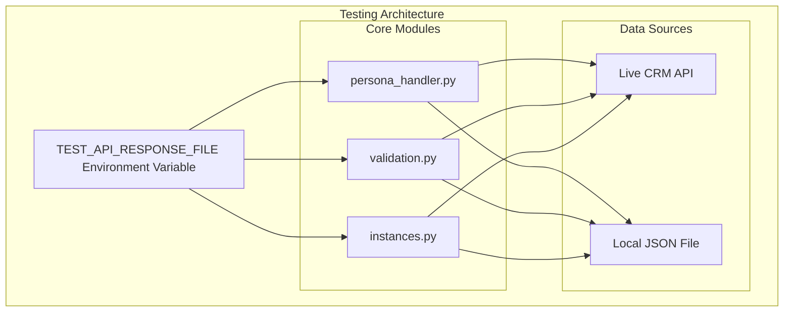
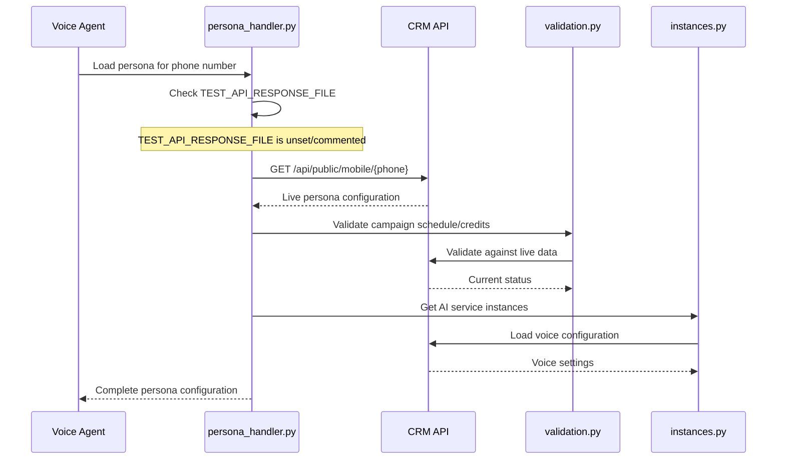
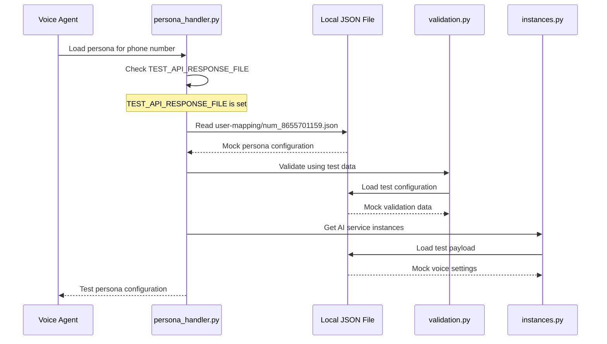
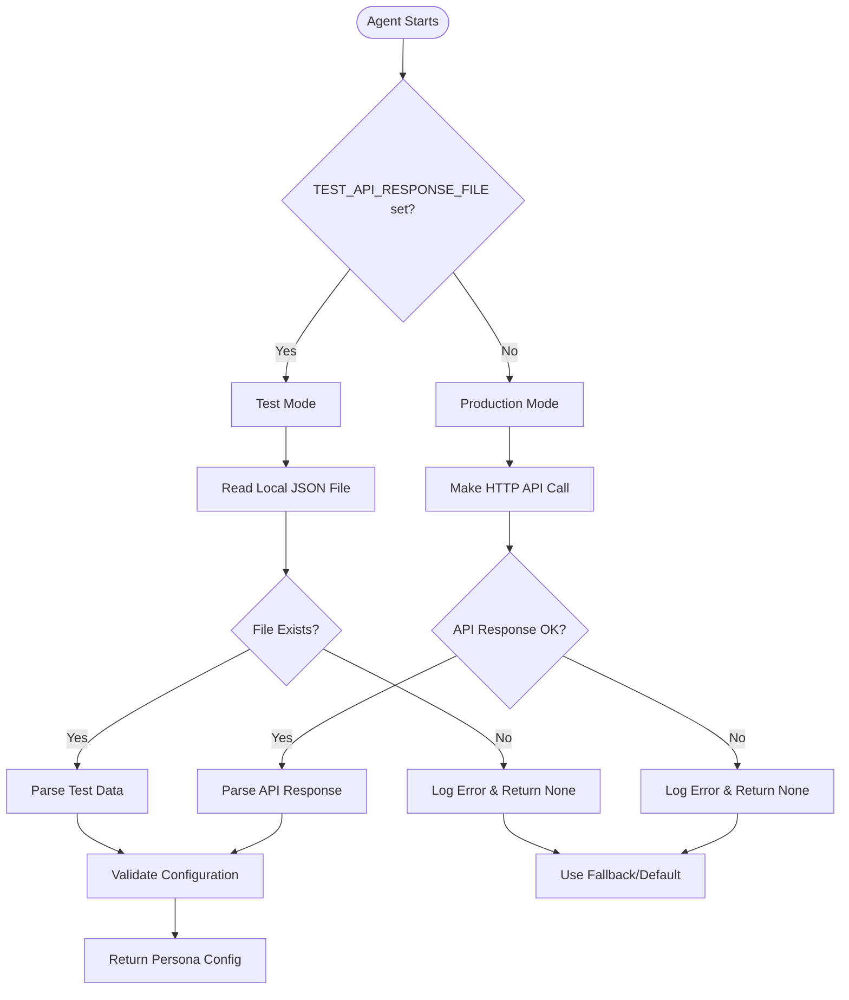
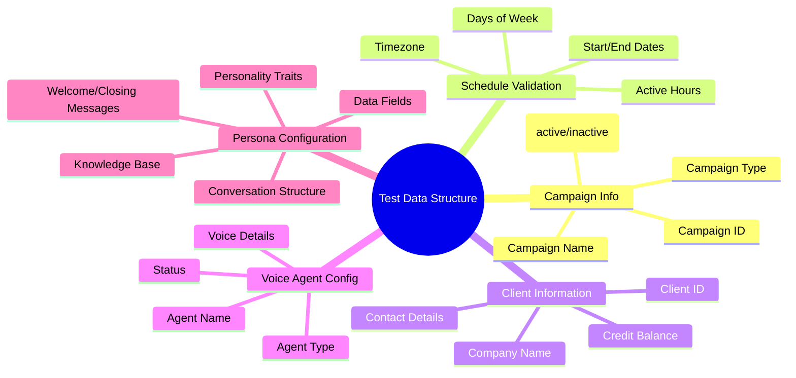
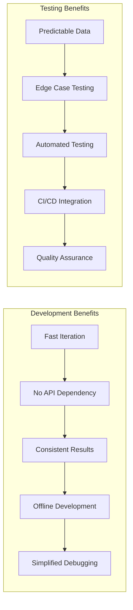
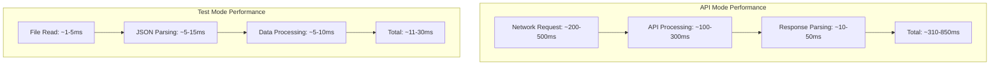

# TEST_API_RESPONSE_FILE Testing Mechanism Documentation

## Overview

The `TEST_API_RESPONSE_FILE` environment variable provides a sophisticated testing mechanism that allows developers to mock API responses by loading data from local JSON files instead of making actual HTTP calls to the persona API. This enables consistent, predictable testing without dependency on external services.

## Table of Contents

- [Architecture Overview](#architecture-overview)
- [Flow Diagrams](#flow-diagrams)
- [Implementation Details](#implementation-details)
- [Usage Patterns](#usage-patterns)
- [Configuration Guide](#configuration-guide)
- [Test Data Structure](#test-data-structure)
- [Benefits and Use Cases](#benefits-and-use-cases)
- [Troubleshooting](#troubleshooting)

## Architecture Overview

The testing mechanism is implemented across three core modules, each handling different aspects of the persona loading and validation system:



## Flow Diagrams

### Normal Production Flow



### Test Mode Flow



### Decision Flow



## Implementation Details

### 1. persona_handler.py Implementation

The primary persona loading logic with test mode support:

```python
@functools.lru_cache(maxsize=256)
def load_persona_from_api(dialed_number: str, timeout: int = 5) -> Optional[Dict]:
    """
    Synchronous persona fetch from CRM API (cached).
    Used as fallback when job metadata is missing.
    
    For testing: If TEST_API_RESPONSE_FILE is set, loads from local file instead of API.
    """
    if not dialed_number:
        return None
    
    # Check for test mode - load from local file
    test_file = os.getenv("TEST_API_RESPONSE_FILE")
    if test_file:
        try:
            logging.info(f"TEST MODE: Loading persona from local file: {test_file}")
            with open(test_file, 'r', encoding='utf-8') as f:
                data = json.load(f)
            logging.info(f"Successfully loaded test data from {test_file}")
            return data
        except Exception as e:
            logging.error(f"Failed to load test data from {test_file}: {e}")
            return None
    
    # Production mode - make actual API call
    try:
        base = os.getenv("PERSONA_API_BASE", "https://devcrm.xeny.ai/apis/api/public/mobile")
        url = f"{base}/{dialed_number}"
        resp = requests.get(url, timeout=timeout)
        resp.raise_for_status()
        data = resp.json()
        return data
    except Exception as e:
        logging.error(f"Failed to load persona from API: {e}")
        return None
```

**Key Features:**
- LRU caching for performance
- Graceful error handling
- Comprehensive logging
- Fallback mechanism

### 2. validation.py Implementation

Campaign schedule and credit validation with test support:

```python
def load_test_config() -> Optional[Dict]:
    """
    Load test configuration from local file for testing validation logic.
    Used when TEST_API_RESPONSE_FILE is set.
    """
    test_file = os.getenv("TEST_API_RESPONSE_FILE")
    if test_file:
        try:
            logging.info(f"TEST MODE: Loading validation config from local file: {test_file}")
            with open(test_file, 'r', encoding='utf-8') as f:
                data = json.load(f)
            logging.info(f"Successfully loaded test config from {test_file}")
            return data
        except Exception as e:
            logging.error(f"Failed to load test config from {test_file}: {e}")
            return None
    return None

def validate_agent_availability(full_config: Dict) -> Tuple[bool, str]:
    """
    Main validation function that checks all conditions.
    Uses test config if TEST_API_RESPONSE_FILE is set.
    """
    # Load test config if in test mode
    test_config = load_test_config()
    if test_config:
        full_config = test_config
        logging.info("Using test configuration for validation")
    
    # Continue with normal validation logic...
```

**Validation Components:**
- Schedule validation (time windows, days of week)
- Credit balance verification
- Campaign status checking
- Timezone handling

### 3. instances.py Implementation

AI service instance configuration with test data support:

```python
def load_test_payload() -> Optional[Dict]:
    """
    Load test payload from local file for testing instance creation logic.
    Used when TEST_API_RESPONSE_FILE is set.
    """
    test_file = os.getenv("TEST_API_RESPONSE_FILE")
    if test_file:
        try:
            print(f"TEST MODE: Loading test payload from local file: {test_file}")
            with open(test_file, 'r', encoding='utf-8') as f:
                data = json.load(f)
            print(f"Successfully loaded test payload from {test_file}")
            return data
        except Exception as e:
            print(f"Failed to load test payload from {test_file}: {e}")
            return None
    return None

def get_instances_from_payload(full_config: Optional[Dict] = None) -> Dict:
    """
    Create AI service instances with test data support.
    """
    # Load test payload if in test mode
    if full_config is None:
        test_payload = load_test_payload()
        if test_payload:
            full_config = test_payload
            print("Using test payload for instance creation")
    
    # Continue with instance creation logic...
```

**Instance Configuration:**
- Text-to-Speech (TTS) voice selection
- Speech-to-Text (STT) configuration
- Large Language Model (LLM) settings
- Voice Activity Detection (VAD) setup

## Usage Patterns

### Development Workflow

```mermaid
gitgraph
    commit id: "Start Development"
    branch feature
    commit id: "Enable Test Mode"
    commit id: "Develop Feature"
    commit id: "Test with Mock Data"
    checkout main
    merge feature
    commit id: "Disable Test Mode"
    commit id: "Deploy to Production"
```

### Testing Scenarios

| Scenario | TEST_API_RESPONSE_FILE | Expected Behavior |
|----------|------------------------|-------------------|
| **Unit Testing** | Set to test file | Uses mock data, predictable results |
| **Integration Testing** | Unset/commented | Uses live API, real-world testing |
| **Offline Development** | Set to test file | No network dependency |
| **Production Deployment** | Unset/commented | Live API calls only |

## Configuration Guide

### Environment Variable Setup

#### Option 1: .env File Configuration

```bash
# .env file

# For Testing (Uncomment to enable test mode)
TEST_API_RESPONSE_FILE=user-mapping/num_8655701159.json

# For Production (Comment out for live API calls)
# TEST_API_RESPONSE_FILE=user-mapping/num_8655701159.json

# Other related configuration
PERSONA_API_BASE=https://devcrm.xeny.ai/apis/api/public/mobile
DEFAULT_CALLER=8655701159
PERSONA_USE=api
```

#### Option 2: Command Line Setup

```powershell
# Enable test mode
$env:TEST_API_RESPONSE_FILE = "user-mapping/num_8655701159.json"

# Disable test mode
Remove-Item Env:TEST_API_RESPONSE_FILE

# Run the agent
python cagent.py
```

#### Option 3: Runtime Configuration

```python
import os

# Enable test mode programmatically
os.environ["TEST_API_RESPONSE_FILE"] = "user-mapping/num_8655701159.json"

# Disable test mode
if "TEST_API_RESPONSE_FILE" in os.environ:
    del os.environ["TEST_API_RESPONSE_FILE"]
```

### File Path Considerations

The test file path is relative to the project root directory:

```
Friday - Copy/
├── .env
├── cagent.py
├── persona_handler.py
├── validation.py
├── instances.py
└── user-mapping/
    ├── num_8655701159.json    # Test data file
    ├── num_1234567890.json    # Additional test scenarios
    └── num_9876543210.json    # Edge case testing
```

## Test Data Structure

### Complete JSON Schema

The test JSON file must follow the exact structure returned by the CRM API:

```json
{
  "mobileNo": "+918655701159",
  "campaigns": [
    {
      "campaignId": "68c91223fde0aa95caa3dbe4",
      "campaignName": "Urban Piper",
      "campaignType": "inbound",
      "status": "active",
      "numbers": {
        "singleNumber": "+918655701159",
        "concurrency": 1,
        "numberArray": [],
        "numberSource": "single"
      },
      "schedule": {
        "activeHours": {
          "start": "01:00",
          "end": "23:00"
        },
        "startDate": "2025-09-01T00:00:00.000Z",
        "endDate": "2025-12-30T00:00:00.000Z",
        "daysOfWeek": ["monday", "tuesday", "wednesday", "thursday", "friday"],
        "timeZone": "Asia/Kolkata"
      },
      "client": {
        "id": "68c90d626052ee95ac77059d",
        "name": "Piper Bot",
        "companyName": "Urban Piper",
        "email": "piperbot@xeny.ai",
        "credits": {
          "balance": 50,
          "totalEarned": 0,
          "totalSpent": 0
        }
      },
      "voiceAgents": [
        {
          "id": "68c9105cfde0aa95caa3db64",
          "name": "piperbot",
          "type": "sales",
          "status": "busy",
          "voiceDetails": {
            "id": "68f88672d07d3e6422a57955",
            "name": "Arushi",
            "gender": "female",
            "language": "ENGLISH",
            "accent": "Indian",
            "age": "adult",
            "voiceModel": "Cartesia",
            "quality": "Premium+UltraRealistic"
          },
          "persona": {
            "id": "68c9105cfde0aa95caa3db64",
            "name": "piperbot",
            "language": "Hindi",
            "additionalLanguages": ["English", "Gujarati", "Bengali"],
            "voice": "Priya",
            "welcomeMessage": "Namaste! Main Urban Piper se piperbot bol rahi hoon...",
            "closingMessage": "Aapka bahut dhanyavaad Urban Piper se sampark karne ke liye...",
            "transferNumber": "",
            "personality": "You are Piperbot, an AI voice assistant for Urban Piper...",
            "conversationStructure": "Always listen first, then answer politely...",
            "workflow": "Knowledge base...",
            "knowledgeBase": "-",
            "dataFields": [
              {
                "field": "registered",
                "type": "Email",
                "description": "ASK FOR REGISTERED MAIL OF USER",
                "_id": "68c9105cfde0aa95caa3db65",
                "id": "68c9105cfde0aa95caa3db65"
              }
            ],
            "status": "busy",
            "client": "68c90d626052ee95ac77059d",
            "createdBy": "68c90d626052ee95ac77059f",
            "tags": [],
            "version": "1.0.0",
            "createdAt": "2025-09-16T07:23:08.444Z",
            "updatedAt": "2025-10-22T07:46:40.538Z"
          }
        }
      ]
    }
  ],
  "totalCampaigns": 1,
  "searchDigits": "55701159"
}
```

### Key Data Elements for Testing



### Test Scenarios Setup

Create multiple test files for different scenarios:

#### Scenario 1: Valid Active Campaign
```json
// user-mapping/num_8655701159.json
{
  "campaigns": [
    {
      "status": "active",
      "schedule": {
        "activeHours": {"start": "00:00", "end": "23:59"},
        "daysOfWeek": ["monday", "tuesday", "wednesday", "thursday", "friday", "saturday", "sunday"]
      },
      "client": {
        "credits": {"balance": 100}
      }
    }
  ]
}
```

#### Scenario 2: Insufficient Credits
```json
// user-mapping/num_low_credits.json
{
  "campaigns": [
    {
      "status": "active",
      "client": {
        "credits": {"balance": 10}
      }
    }
  ]
}
```

#### Scenario 3: Outside Business Hours
```json
// user-mapping/num_closed_hours.json
{
  "campaigns": [
    {
      "status": "active",
      "schedule": {
        "activeHours": {"start": "09:00", "end": "17:00"},
        "daysOfWeek": ["monday", "tuesday", "wednesday", "thursday", "friday"]
      }
    }
  ]
}
```

## Benefits and Use Cases

### 🚀 Development Benefits



### Use Case Matrix

| Use Case | Benefits | Implementation |
|----------|----------|----------------|
| **Unit Testing** | Predictable results, fast execution | Set TEST_API_RESPONSE_FILE in test setup |
| **Integration Testing** | Full system testing without external deps | Mock complete API responses |
| **Development** | No API rate limits, offline work | Use local test files |
| **Debugging** | Isolate issues, known data state | Fixed test scenarios |
| **CI/CD Pipelines** | Reliable builds, no external dependencies | Automated test file switching |
| **Demo/Training** | Consistent behavior, controlled scenarios | Curated persona examples |

### Performance Comparison



## Troubleshooting

### Common Issues and Solutions

#### Issue 1: File Not Found Error

```bash
ERROR: Failed to load test data from user-mapping/num_8655701159.json: [Errno 2] No such file or directory
```

**Solution:**
1. Verify file path is relative to project root
2. Check file exists: `ls user-mapping/num_8655701159.json`
3. Ensure correct file extension (.json)

#### Issue 2: JSON Parse Error

```bash
ERROR: Failed to load test data: Expecting ',' delimiter: line 15 column 5 (char 523)
```

**Solution:**
1. Validate JSON syntax: Use online JSON validator
2. Check for trailing commas
3. Verify proper escaping of strings

#### Issue 3: Missing Required Fields

```bash
WARNING: No campaigns found for test data
```

**Solution:**
1. Ensure test file has `campaigns` array
2. Verify campaign objects have required fields
3. Check persona configuration structure

#### Issue 4: Environment Variable Not Recognized

```bash
INFO: PERSONA_USE=api: Using API-based persona loading
```

**Solution:**
1. Verify .env file is in project root
2. Check environment variable syntax
3. Restart application after .env changes

### Debug Commands

```powershell
# Check environment variable
echo $env:TEST_API_RESPONSE_FILE

# Validate JSON file
python -m json.tool user-mapping/num_8655701159.json

# Test file reading
python -c "import json; print(json.load(open('user-mapping/num_8655701159.json')))"

# Run with debug logging
$env:LOG_LEVEL = "DEBUG"
python cagent.py
```

### Logging Analysis

Look for these log messages to verify test mode operation:

```
INFO: TEST MODE: Loading persona from local file: user-mapping/num_8655701159.json
INFO: Successfully loaded test data from user-mapping/num_8655701159.json
INFO: TEST MODE: Loading validation config from local file: user-mapping/num_8655701159.json
INFO: Using test configuration for validation
```

## Integration with CI/CD

### GitHub Actions Example

```yaml
name: Test with Mock Data
on: [push, pull_request]

jobs:
  test:
    runs-on: ubuntu-latest
    steps:
      - uses: actions/checkout@v3
      
      - name: Setup Python
        uses: actions/setup-python@v4
        with:
          python-version: '3.9'
          
      - name: Install dependencies
        run: pip install -r requirements.txt
        
      - name: Run tests with mock data
        env:
          TEST_API_RESPONSE_FILE: user-mapping/num_8655701159.json
          PERSONA_USE: api
        run: |
          python -m pytest tests/ -v
          python test_persona_loading.py
```

### Docker Testing

```dockerfile
# Dockerfile.test
FROM python:3.9

COPY requirements.txt .
RUN pip install -r requirements.txt

COPY . /app
WORKDIR /app

# Set test mode
ENV TEST_API_RESPONSE_FILE=user-mapping/num_8655701159.json
ENV PERSONA_USE=api

CMD ["python", "-m", "pytest", "tests/", "-v"]
```

## Conclusion

The `TEST_API_RESPONSE_FILE` mechanism provides a robust, flexible testing infrastructure that enables:

- **Reliable Testing**: Consistent, predictable results across all test runs
- **Rapid Development**: Fast iteration without API dependencies
- **Comprehensive Coverage**: Test edge cases and error scenarios
- **Production Safety**: Clear separation between test and production modes
- **CI/CD Integration**: Automated testing with mock data

This system exemplifies best practices in software testing by providing a clean interface for switching between live and mock data sources, enabling developers to build robust voice agent applications with confidence.