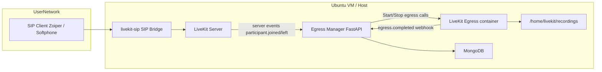
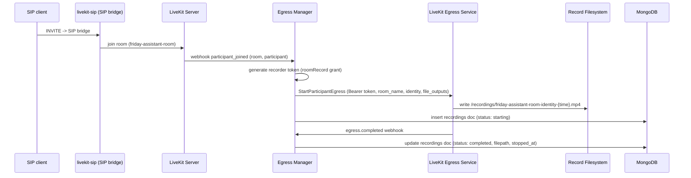

# Call Recording Design — LiveKit + SIP Bridge

Last updated: 2025-10-17

This document explains the call-recording approach implemented in this repo. It includes architecture diagrams (Mermaid), payload examples, naming conventions, the Mongo schema, testing checklist, edge cases, and a migration plan from a single shared room to per-call unique rooms.

## Goals

- Record inbound SIP calls routed through LiveKit into durable audio files.
- Produce both mixed two-way audio (single audio-only MP4) and per-track audio files (for ASR/transcription).
- Persist metadata (room, egress_id, caller, file path, timestamps, status) to MongoDB.
- Start recordings automatically when participants join and stop on egress completion or participant leave.
- Support both current single fixed-room setup and recommended unique-per-call rooms.

## High-level architecture



Notes:
- SIP Bridge currently maps inbound calls to a fixed room (`friday-assistant-room`).
- `Egress Manager` receives LiveKit webhooks and orchestrates egress start/stop calls to the LiveKit Egress service.
- Egress container writes files into a host-mounted recordings folder (recommended: `/home/livekit/recordings`).

## Sequence diagram — call lifecycle



## Current code locations

- `egress_manager/app.py` — FastAPI microservice that handles token generation, egress calls, and webhook processing.
- `docker-compose.egress.yml` — brings up the LiveKit Egress container and mounts `/home/livekit/recordings`.
- `conversations/` and `leads/` — existing repo folders for other flows.
- `recording/recording.py` — placeholder (unused) in the repo. Consider using it for ingest or local reproduction scripts.

## File naming conventions

- Mixed participant egress (audio-only mp4):

  /recordings/{room_name}-{identity}-{time}.mp4

  - `room_name`: LiveKit room name
  - `identity`: participant identity (e.g., `sip_1001`)
  - `{time}`: LiveKit egress `{time}` template, or an ISO timestamp

- Per-track egress (passthrough):

  /recordings/{room_name}-{track_id}-{time}.ogg

Recommendation: include a UUID where collisions are possible: `{room}-{identity}-{time}-{uuid}`.

## MongoDB schema (`recordings` collection)

Document example (inserted on egress start):

```json
{
  "_id": "ObjectId(...)",
  "room_name": "friday-assistant-room",
  "egress_id": "EG_SOMEID",
  "caller_number": "+91XXXXXXXXX",
  "agent_identity": "sip_1001",
  "filepath": null,
  "started_at": "2025-10-17T06:15:13Z",
  "stopped_at": null,
  "duration_sec": null,
  "status": "starting",
  "tracks": []
}
```

On `egress_completed`, update:
- `status` -> `completed`
- `filepath` (or `tracks[].filepath`)
- `stopped_at`
- optionally `duration_sec` computed from started/stopped timestamps

Index recommendations:
- index on `egress_id` (unique)
- index on `started_at`
- index on `room_name`

## Webhook payload examples

participant_joined (LiveKit -> Egress Manager):

```json
{
  "event": "participant_joined",
  "room": {"name": "friday-assistant-room", "sid": "RM_..."},
  "participant": {
    "identity": "sip_1001",
    "sid": "PA_...",
    "name": "+911234567890",
    "metadata": {"phone": "+911234567890"}
  }
}
```

egress_completed (LiveKit Egress -> Egress Manager):

```json
{
  "event": "egress_completed",
  "info": {
    "egress_id": "EG_xxx",
    "room_name": "friday-assistant-room",
    "outputs": [
      {"filepath": "/recordings/friday-assistant-room-sip_1001-2025-10-17T06-15-13.mp4"}
    ],
    "duration_seconds": 32
  }
}
```

> Note: Your LiveKit/Egress version may differ; log real payloads and adapt parsing as needed.

## Egress start payload (examples)

StartParticipantEgress (audio-only mp4):

```json
{
  "room_name": "friday-assistant-room",
  "identity": "sip_1001",
  "audio_only": true,
  "file_outputs": [
    {"filepath": "/recordings/friday-assistant-room-sip_1001-{time}.mp4", "disable_video": true}
  ]
}
```

StartTrackEgress (per-track passthrough .ogg):

```json
{
  "room_name": "friday-assistant-room",
  "track_id": "TR_SOME_TRACK_ID",
  "file": {"filepath": "/recordings/friday-assistant-room-TR_SOME_TRACK_ID-{time}.ogg"}
}
```

StopEgress payload:

```json
{ "egress_id": "EG_xxx" }
```

EGRESS_URL typical for Twirp-based egress container:

```
http://localhost:7880/twirp/livekit.Egress
```

## Recorder token (JWT) details

- Issuer: `LIVEKIT_API_KEY`
- Secret: `LIVEKIT_API_SECRET` (HMAC-SHA256)
- Grants: `{ "room": "<room_name>", "roomRecord": true }`
- TTL: short-lived (e.g., 1 hour or less)

Python generator (implementation in `egress_manager/app.py`): `generate_recorder_token(room_name, ttl_seconds=3600)`.

Security notes:
- Keep `LIVEKIT_API_SECRET` secret and out of VCS.
- Optionally enable webhook signing and set `WEBHOOK_SECRET` to verify.

## Edge cases and failure modes

1. Participant joins and leaves quickly -> start call may fail or egress may finish immediately. Persist partial metadata and handle missing `egress_id` gracefully.
2. Token expiry -> generate token immediately before making start call.
3. Disk full or permission issues -> egress container fails to write; add healthchecks and alerts.
4. Egress API shape differences across versions -> inspect egress logs and adjust request/response parsing.
5. Concurrent calls in a fixed room -> file naming collisions if identity not unique. Prefer unique rooms per call.

## Testing & validation checklist

1. Create recordings folder and set permissions on host:

```bash
sudo mkdir -p /home/livekit/recordings
sudo chown $USER:$USER /home/livekit/recordings
sudo chmod 770 /home/livekit/recordings
```

2. Start Egress container:

```bash
docker-compose -f docker-compose.egress.yml up -d
curl http://localhost:7880/health
```

3. Run Egress Manager locally:

```bash
cd egress_manager
cp .env.example .env   # fill values
pip install -r requirements.txt
uvicorn egress_manager.app:app --host 0.0.0.0 --port 5000
```

4. Send a simulated participant_joined webhook to `/webhook` (see payload example). Verify:
- Egress Manager calls StartParticipantEgress and returns `egress_id`.
- Mongo `recordings` doc created (status: starting).

5. Simulate `egress_completed` webhook and verify Mongo updates with `status: completed` and `filepath` set.

6. Make an actual SIP call through your SIP bridge and verify files land in `/home/livekit/recordings` and DB updates occur.

7. Test concurrent calls: verify no collision and separate DB entries.

## Migration plan: fixed-room -> unique per-call rooms

Why change:
- Fixed room causes concurrency and naming problems.
- Unique rooms isolate each call and simplify metadata and retention.

Steps:
1. Update SIP dispatch rules to map each incoming call to `call-<uuid>` (your SIP bridge supports templating).
2. Ensure `Egress Manager` reads `room.name` from webhook payload (no change required if it does).
3. Update file naming to include room folder: `/recordings/{room_name}/{identity}-{time}.mp4`.
4. Test single and concurrent calls, update downstream tooling that assumes fixed room.

If you cannot change SIP mapping now, keep the fixed room and ensure participant `identity` values are unique and use identity+timestamp in filenames.

## Operational recommendations

- Add retention/cleanup job: rotate or upload >=30-day files to S3/MinIO and delete local copies.
- Monitor egress container health and set alerts for `/health` failures.
- Add CI to run unit tests and basic linting for `egress_manager`.

## Next steps (pick one to implement next)

- A. Auto-start Track Egress: start per-track egress on publish and populate `tracks[]` in Mongo.
- B. Add admin REST endpoints for manual start/stop egress.
- C. Add S3/MinIO upload post-egress and retention logic.
- D. Wire `handler.py` (persona webhook) to call the Egress Manager for coordinated behavior.
- E. Harden egress_manager: retry/backoff, metrics, logging.

---

File saved to: `docs/call_recording_design.md` in repository root.

If you want, I can now implement A (automatic Track Egress) and add tests & DB wiring — say "Do A" and I'll start. 
