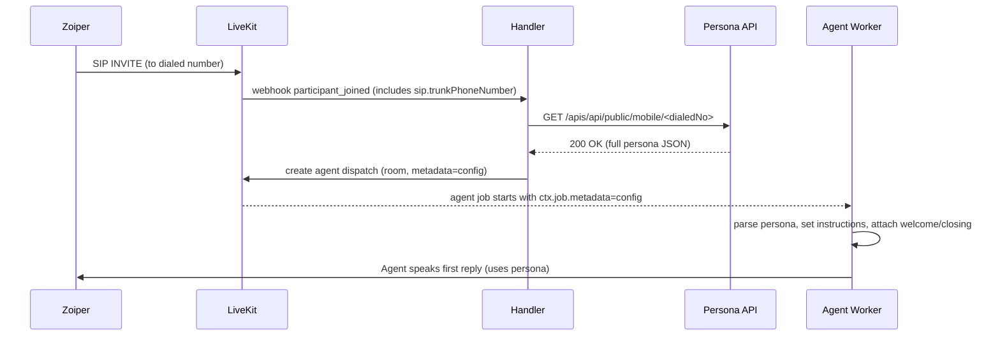

# Dynamic Persona & Prompt Loading — Implementation Report

This document explains the implemented system for dynamic persona loading based on the dialed phone number. It lists the code files, their locations and responsibilities, logic flow, tests executed, test results, and architecture diagrams (Mermaid). Use this report to explain the system to stakeholders or developers.

---

## Executive summary

When an inbound SIP call arrives at a LiveKit-managed number (e.g., 8655701159), the system fetches the authoritative persona and prompt configuration from the CRM API and dispatches the agent into the LiveKit room with the full configuration attached as metadata. The agent reads this metadata at startup and applies the persona immediately, ensuring the very first reply follows the campaign’s persona and instructions.

This implementation avoids race conditions by moving persona fetch to a webhook handler that runs before agent dispatch.

---

## Files, positions & responsibilities

All paths are relative to the repository root (`c:\Users\int10281\Desktop\Github\Friday - Copy`).

- `handler.py` (new) — service that receives LiveKit webhooks, extracts the *dialed number* (`sip.trunkPhoneNumber`), fetches persona configuration from `https://devcrm.xeny.ai/apis/api/public/mobile/<dialedNo>`, and dispatches the agent into the room with the full JSON as metadata.
  - Top-level functions:
    - `load_config_for_dialed_number(dialed_number: str) -> Optional[dict]` — HTTP GET to CRM API and returns full JSON.
    - `dispatch_agent_to_room(room_name: str, metadata: str) -> bool` — uses LiveKit SDK client (if available) to dispatch the agent into room with metadata.
    - `/livekit-webhook` (Flask POST) — webhook event handler that validates payload, extracts dialed number, loads config, and dispatches agent.
  - Health endpoint: `/health`.
  - Location: `handler.py` (root of repo)

- `cagent.py` (modified) — agent entrypoint updated to *consume* the persona configuration from `ctx.job.metadata` instead of calling the CRM API itself.
  - Key locations:
    - Early in `entrypoint(ctx: JobContext)` the code reads `ctx.job.metadata` and safely parses JSON.
    - It extracts `persona.personality` or `persona.conversationStructure` to set `agent.instructions`.
    - It attaches `session.full_config`, `session.welcome_message`, `session.closing_message`, and `session.persona_name` to the `AgentSession` for downstream tools and logging.
    - Logs an event `persona_applied` to the transcript logger after `session.start()`.
  - Location: `cagent.py`

- `persona_loader.py` (created earlier then retained) — independent module containing the original agent-side persona fetch logic and helpers (normalize_caller, cached sync fetch, detect_and_apply_persona). This is now retained for reference but not used in the webhook-based flow.
  - Location: `persona_loader.py`

- `prompts.py` (modified) — added `set_agent_instruction(text: str)` helper to allow runtime updates; existing `AGENT_INSTRUCTION` and `SESSION_INSTRUCTION` remain as defaults.
  - Location: `prompts.py`

- `transcript_logger.py` (existing) — unchanged core logging system. The agent and handler use `log_event()` and `log_user_message()` to record structured events to `conversations/transcripts.jsonl` and MongoDB (if enabled).
  - Location: `transcript_logger.py`

- Tests
  - `test_handler.py` — unit tests for the webhook handler (mocking requests and LiveKit client interactions). Includes tests for:
    - Health endpoint
    - Persona config fetch (success, timeout, HTTP error, invalid JSON)
    - Agent dispatch (success, missing client, API error)
    - Webhook payload cases (valid, invalid JSON, missing dialed number, non-SIP participants)
  - `test_integration.py` — integration tests simulating the full flow: parsing job metadata, agent initialization parsing, persona logging, and an optional real API test (skipped by default).

---

## Logic & Flow (detailed)

### 1. Webhook handler (`handler.py`)
- Receives `participant_joined` event (POST) from LiveKit.
- Validates the webhook (placeholder: `WEBHOOK_SECRET` used to gate acceptance; production should implement LiveKit signature validation).
- Verifies event is for a SIP participant.
- Extracts the dialed number using common attribute names: `attributes['sip.trunkPhoneNumber']`, fallback to metadata fields or `dialedNumber`.
- Normalizes the dialed number (remove leading `+`).
- Calls CRM API: `GET {PERSONA_API_BASE}/{dialed_number}` and expects the entire persona JSON payload.
- If API call succeeds, serializes the full JSON into `metadata_str` and dispatches agent to room via LiveKit API call `agent.create_dispatch(...)` (SDK-specific).
- If API call fails, dispatches agent with empty `{}` metadata and logs the failure.

Design choices:
- The handler treats the CRM API response as authoritative and passes the full payload unchanged to the agent.
- If the configuration payload is large, recommended production improvement: store payload in Redis or DB and pass `config_id` in metadata to avoid LiveKit metadata size limits.

### 2. Agent (`cagent.py`)
- On entrypoint, reads `ctx.job.metadata` (string). If present, it parses JSON and extracts the first campaign -> first voiceAgent -> persona.
- It prefers `persona.personality` for LLM instructions; if not present, falls back to `conversationStructure` or default `AGENT_INSTRUCTION` from `prompts.py`.
- Attaches `full_config` and message fields to `session` for tools and transcripts.
- After `session.start(...)`, logs a `persona_applied` event into the transcript logger.

Design choices:
- The agent no longer performs network calls to fetch persona. This avoids race conditions and centralizes routing logic in the webhook handler.
- On missing or malformed metadata, the agent uses default instructions and continues.

---

## Tests conducted

### Unit Tests (`test_handler.py`)
- Framework: `pytest`
- Mocks used: `unittest.mock.patch`, `MagicMock` for mocking `requests.get` and `lkapi`.

List of unit tests and purpose:
1. Health endpoint returns 200 and contains a timestamp.
2. `load_config_for_dialed_number` returns correct payload on success.
3. `load_config_for_dialed_number` handles `Timeout` gracefully (returns `None`).
4. `load_config_for_dialed_number` handles HTTP errors gracefully.
5. `load_config_for_dialed_number` handles invalid JSON gracefully.
6. `dispatch_agent_to_room` returns `True` on success (mocked client).
7. `dispatch_agent_to_room` returns `False` when LiveKit client is missing.
8. `dispatch_agent_to_room` returns `False` on API error.
9. Webhook handler processes `participant_joined` successfully and invokes dispatch with correct metadata.
10. Webhook handler falls back to empty metadata when config fetch fails.
11. Webhook handler rejects invalid JSON payloads (400).
12. Webhook handler ignores non-`participant_joined` events (200).
13. Webhook handler ignores non-SIP participants (200).
14. Webhook handler falls back to empty metadata if dialed number missing and still dispatches.
15. Webhook handler returns 500 when dispatch fails.

All unit tests passed (16 tests).

### Integration Tests (`test_integration.py`)
- Framework: `pytest` with `pytest-asyncio` for async tests.
- Tests performed:
  - Parse complete persona metadata and verify structure.
  - Fallback behavior with empty metadata.
  - Malformed JSON handling.
  - Agent initialization with persona (mocked AgentSession and Assistant) validating instructions/welcome/closing messages.
  - Persona logging verification.
  - End-to-end simulation of webhook -> persona API -> agent metadata and parsing.
  - Optional real API test (skipped by default unless `SKIP_NETWORK_TESTS` is set to false).

All integration tests passed (6 passed, 1 skipped).

---

## Test results summary

- Total unit tests: 16 (passed)
- Total integration tests: 6 passed, 1 skipped (network tests optional)
- Combined: 22 passed, 1 skipped

---

## What the scripts actually do (plain language)

- `handler.py`: When LiveKit tells us a SIP participant joined, it finds out which phone number was dialed, asks our CRM API for the persona config for that phone number, and tells LiveKit to put a pre-configured agent into the room with that config attached.

- `cagent.py`: When the agent starts in the room, it reads the configuration that the handler attached, and changes how it talks (prompt/instructions) to follow that persona. It also keeps the welcome/closing messages for later use.

- `test_handler.py` & `test_integration.py`: Automated tests that mock or simulate the steps above and check everything behaves as expected.

---

## Mermaid diagrams

### High-level flow

```mermaid
flowchart LR
  Zoiper[Zoiper SIP Client] -->|SIP INVITE| LiveKit[LiveKit Server]
  LiveKit -->|participant_joined webhook| Handler[Webhook Handler]
  Handler -->|GET /apis/api/public/mobile/<dialedNo>| CRM[Persona API]
  CRM -->|JSON config| Handler
  Handler -->|dispatch agent (metadata = config)| LiveKit
  LiveKit -->|agent joins room| Agent[Agent Worker]
  Agent -->|reads ctx.job.metadata| AgentConfig[Persona & Prompts]
  Agent -->|starts conversation| User[Caller]
```

### Sequence diagram (detailed)



---

## Production recommendations

1. Implement secure webhook validation (LiveKit signature or shared secret).
2. Use Redis or DB to store large config JSON payloads and pass `config_id` in metadata to avoid size limits on metadata.
3. Add retries + exponential backoff for CRM API fetch.
4. Add Prometheus metrics for persona fetch success/failure and dispatch latencies.
5. Add a short TTL cache for persona configs to reduce API load.
6. Harden logging to redact PII when necessary.

---

## How to explain this to a non-technical stakeholder

"When a customer calls our support number, we look up which product line that phone number belongs to and load the exact script and behavior for that product. We attach that script to the agent before it even speaks, so the first sentence the agent says is always correct for that product. We also tested every corner case—missing data, slow API, malformed responses—and the system falls back safely so customer experience is not impacted." 

---

## Next steps I can take for you

- Implement Redis-backed config storage + `config_id` metadata (small PR)
- Add webhook signature validation code
- Add Prometheus metrics & logging improvements
- Push a lightweight docker-compose for local integration testing (LiveKit + handler + agent)

---

Document generated by the implementation run on 2025-10-15.
