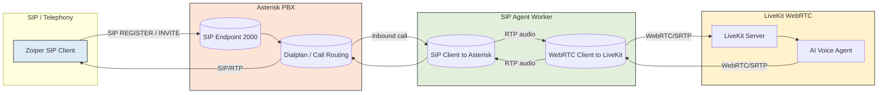

```mermaid
flowchart LR

    subgraph SIP_World [SIP / Telephony]
        Z[Zoiper SIP Client]
    end

    subgraph PBX [Asterisk PBX]
        A1[(SIP Endpoint 2000)]
        A2[(Dialplan / Call Routing)]
    end

    subgraph Agent_Worker [SIP Agent Worker]
        W1[(SIP Client to Asterisk)]
        W2[(WebRTC Client to LiveKit)]
    end

    subgraph LiveKit_World [LiveKit WebRTC]
        LK[LiveKit Server]
        AI[AI Voice Agent]
    end

    %% Call flow arrows
    Z -->|SIP REGISTER / INVITE| A1
    A1 --> A2
    A2 -->|Inbound call| W1
    W1 -->|RTP audio| W2
    W2 -->|WebRTC/SRTP| LK
    LK --> AI

    %% Audio return path
    AI -->|WebRTC/SRTP| W2
    W2 -->|RTP audio| W1
    W1 --> A2
    A2 -->|SIP/RTP| Z

    style Z fill:#DDEBF7,stroke:#000,stroke-width:1px
    style PBX fill:#FCE4D6,stroke:#000,stroke-width:1px
    style Agent_Worker fill:#E2EFDA,stroke:#000,stroke-width:1px
    style LiveKit_World fill:#FFF2CC,stroke:#000,stroke-width:1px
```